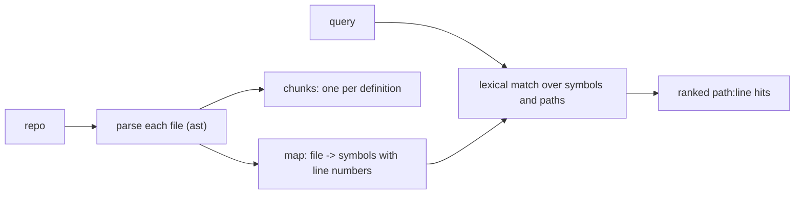

# The Repo Map

> **Motto** — Give the agent a map of the repo's symbols and cut code on structure, so it can find the right place before it reads.

*Part of Phase 08 — Extending: MCP, Skills, Retrieval.*

*Last reviewed: 2026-10 · Volatility: medium*

## The Problem

On a large repo, the agent first needs orientation. Which files exist? What does each one define? Reading every file costs too much context. Running `grep` on guessed strings wastes turns.

A **repo map** is a compact index: each file, with the functions and classes inside it and their line numbers. It is small enough to sit in context. The agent reads the map, picks a file, and then reads only that part.

Retrieval has a second need. To search code by meaning, you cut files into chunks. A fixed cut ("every 50 lines") slices functions in half. Cut on structure instead.

## The Concept



One parse feeds two products. The **map** lists every definition, nested ones included. A method appears as `Session.open`, so a search for `open` finds it. The **chunks** are whole definitions that you can embed in the next lesson.

Lexical search is the cheap first pass. It finds names. Semantic search is the deeper second pass. It finds meaning.

## Build It

`code/repo_map.py` uses Python's `ast` module. The `symbols` function walks definitions at every depth and builds qualified names:

```python
def symbols(source, prefix="", body=None):
    """List every def/class, nested ones too, with qualified names like Session.open."""
    out = []
    for node in ast.parse(source).body if body is None else body:
        if isinstance(node, DEFS):
            name = prefix + node.name
            kind = "class" if isinstance(node, ast.ClassDef) else "def"
            out.append({"name": name, "kind": kind, "line": _start(node), "end": node.end_lineno})
            out += symbols(source, name + ".", node.body)
    return out
```

A decorated function starts at its first decorator, not at `def`. The helper `_start` takes the earliest line, so a chunk never loses its decorators.

The `chunks` function makes one chunk per top-level definition. A class larger than `max_lines` splits into its methods, each labelled with the class name. This keeps every chunk small enough to embed and still named after its parent:

```python
        if isinstance(node, ast.ClassDef) and node.end_lineno - _start(node) + 1 > max_lines:
            out += [make(f"{node.name}.{m.name}", m) for m in node.body if isinstance(m, DEFS)]
        else:
            out.append(make(node.name, node))
```

`build_map` walks a directory, skips `.git` and virtual environments, and returns the files it could not parse. It reports them instead of hiding them. `search` ranks an exact name above a prefix, and a prefix above a substring.

The asserts cover the hard cases: an `async def`, two decorators, a function inside a function, a class split into methods, a file with a syntax error, and the ranking order.

Module-level code between definitions is not chunked. A script with logic at the top level needs a "module" chunk too.

## Use It

`ast` works for Python only. For other languages you need another parser, such as tree-sitter. The design stays the same: parse, list definitions, record lines.

You can write a map by hand. A `CLAUDE.md` that says where things live (see [Memory Files](../../../04-prompts-and-instructions/02-memory-files/docs/en.md)) is a repo map in prose. It saves the agent the discovery work on every session. Exact-string search is still the right tool when you know the string; see [Search](../../../05-files-and-shell/03-search/docs/en.md).

Keep the generated map short. A map of thousands of files can cost more than it saves. Measure yours. Show only the directories the task touches, or rank by the query.

## Challenge

Add a `module` chunk for top-level statements outside any definition (imports and script code). Assert that every line of a sample file belongs to exactly one chunk.

Next: [A search_code tool](../../05-search-code-tool/docs/en.md)
