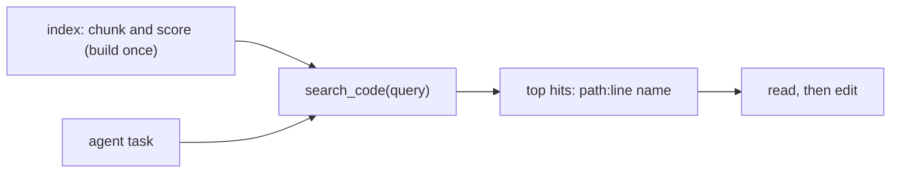

# A search_code Tool

> **Motto** — Wrap chunk, index and rank into one `search_code` tool that returns `path:line` hits the agent can act on.

*Part of Phase 08 — Extending: MCP, Skills, Retrieval.*

*Last reviewed: 2026-10 · Volatility: fast*

## The Problem

You have a repo map and structural chunks. The agent still needs one call it can make: "find the code that does X." Without it, the agent guesses names, runs `grep`, and reads whole files.

A **retrieval tool** answers that call. `search_code(query)` returns a short ranked list of locations. The agent then reads those locations and edits them. The tool does not return the code itself. It returns pointers, so the answer stays small.

## The Concept



Build the index once. Search it on every task. A hit is `path:line  name`. The agent opens that line with the read tool.

A good retrieval tool also knows when it has nothing. A query with no match must return an empty answer. A tool that always returns its "closest" chunk sends the agent to the wrong file with full confidence.

## Build It

`code/retrieval_tool.py` is one stdlib file. It cuts each Python file into one chunk per top-level definition, with decorators included. The scorer is TF-IDF: a word that appears in few chunks counts for more than a word that appears everywhere. This is a lexical scorer. It matches shared words and does not understand meaning. A real embedding model would, and the next section says where it plugs in.

The tokenizer splits `loginUser` and `login_user` into `login` and `user`, so a query in prose can match an identifier:

```python
def tokens(text):
    """Lowercase words. Split snake_case and camelCase so `loginUser` matches `login`."""
    spaced = re.sub(r"([a-z])([A-Z])", r"\1 \2", text)
    return [w for w in re.findall(r"[A-Za-z]+", spaced.lower()) if len(w) > 2]
```

The search method scores each chunk and drops chunks with no shared word:

```python
            if score > 0:                              # no shared word, no hit
                scored.append((score, f"{ch['path']}:{ch['line']}  {ch['name']}"))
```

`TOOL_SPEC` and `tool_call` wrap the search as a tool in the shape from [lesson 01](../../01-mcp-protocol-server-client/docs/en.md): an `inputSchema`, and a result with `content` and `isError`. An empty query returns `isError: true`. A query with no match returns a normal `no matches` result, because the tool worked and found nothing.

The asserts index a temp directory that holds a file with a syntax error. They check that the broken file is skipped, that prose finds the right function, that `loginUser` splits, that a decorated class reports its decorator line, and that an unrelated query returns nothing.

## Use It

`code/search_server_sdk.py` serves the same tool through the official SDK from [lesson 02](../../02-official-mcp-sdk/docs/en.md). It needs `pip install mcp`. I ran its `--check` mode against `mcp` 2.2.0 with an in-memory client. Register it with Claude Code:

```bash
claude mcp add --env REPO_ROOT=. code-search -- python3 code/search_server_sdk.py
```

Return hits, not files. Claude Code warns when an MCP tool returns more than 10,000 tokens, and its default maximum is 25,000 (`MAX_MCP_OUTPUT_TOKENS` changes it). A list of ten `path:line` strings is far below that.

To get semantic search, swap the scorer for an embedding model and keep the same tool shape. Claude Code already has `Glob` and `Grep` for exact matches, so a retrieval tool pays off when the question is about meaning and you do not know the names.

## Challenge

Make the index incremental. Add `update_file(path, source)` that removes a file's old chunks and adds the new ones, and keep `df` correct. Assert that after you rewrite `auth.py` with a new function name, a search finds the new name and no longer finds the old one.

## Sources

Claude Code docs, "Connect to tools via MCP" (code.claude.com/docs).

Next: [Failure ladder](../../../09-reliability-evals-and-ops/01-failure-ladder/docs/en.md)
