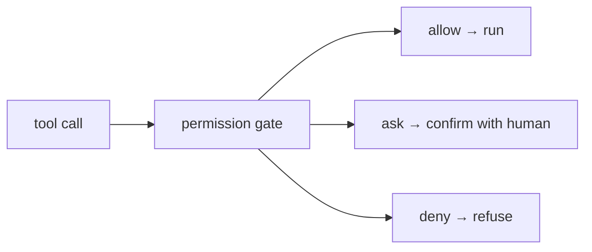

# Permission modes (ask / allow / deny)

> **Motto** — Every tool call passes through a gate that says allow, ask, or deny.

*Part of Phase 08 — Permissions & Safety Gating.*

## The Problem

An agent that runs every tool call unchecked is a liability; one that asks before *every*
call is unusable. The resolution is **modes**: a per-call decision — allow automatically,
ask the human, or deny outright — driven by rules, so routine reads run free while
destructive actions stop for confirmation. This gate is the single most important safety
component in the harness.

## The Concept



A default mode plus rules: e.g. default-ask, with reads allowlisted to allow and dangerous
patterns denylisted to deny.

## Build It

`code/permission_modes.py` — a gate with a default and rule overrides:

```python
ALLOW, ASK, DENY = "allow", "ask", "deny"

class PermissionGate:
    def __init__(self, default=ASK, rules=None):
        self.default = default
        self.rules = rules or []          # list of (predicate, mode)

    def decide(self, tool, args):
        for predicate, mode in self.rules:
            if predicate(tool, args):
                return mode
        return self.default

    def run(self, tool, args, execute, confirm):
        mode = self.decide(tool, args)
        if mode == DENY:
            return "denied by policy"
        if mode == ASK and not confirm(tool, args):
            return "denied by user"
        return execute(tool, args)
```

```python
gate = PermissionGate(default=ASK, rules=[
    (lambda t, a: t in ("read", "grep", "glob"), ALLOW),    # reads: auto
    (lambda t, a: t == "bash" and "rm -rf" in a.get("cmd", ""), DENY),
])
print(gate.decide("read", {}))                       # allow
print(gate.decide("bash", {"cmd": "rm -rf /"}))      # deny
print(gate.decide("write", {}))                      # ask (default)
```

The gate centralizes the allow/ask/deny decision so it's consistent and auditable, instead
of scattered `if` checks.

## Use It

This is Claude Code's **permission modes** (default, acceptEdits, plan, and the
`--dangerously-skip-permissions` escape hatch) and Codex's approval settings: reads and
edits can be auto-approved while shell or network actions prompt. You tune the rules so the
agent flows on safe work and stops on risky work — never the reverse.

## Ship It

[`code/permission_modes.py`](../../01-permission-modes/code/permission_modes.py) — an
allow/ask/deny permission gate.

## Check Yourself

**Q1.** Why not ask before every tool call?

- A) it's unsafe
- B) it's unusable; modes let safe calls flow while risky ones stop for confirmation
- C) the API forbids it
- D) no reason

<details><summary>Answer</summary>B — modes balance safety and usability.</details>

**Q2.** A good default for an untrusted/auto context is…

- A) allow everything
- B) default-ask (or deny), with reads allowlisted to allow
- C) deny everything
- D) random

<details><summary>Answer</summary>B — conservative default, widen deliberately.</details>

**Challenge.** Add a `plan` mode that denies all *mutating* tools (write/edit/bash) while
allowing reads — the read-only "propose first" mode from Phase 11.

## Related

- Builds on: Phase 3 — [Tool registry](../../../03-tool-engineering/08-tool-registry/docs/en.md)
- Next: [Allowlists, denylists & pattern matching](../../02-allow-deny/docs/en.md)
- [Roadmap](../../../../ROADMAP.md)
