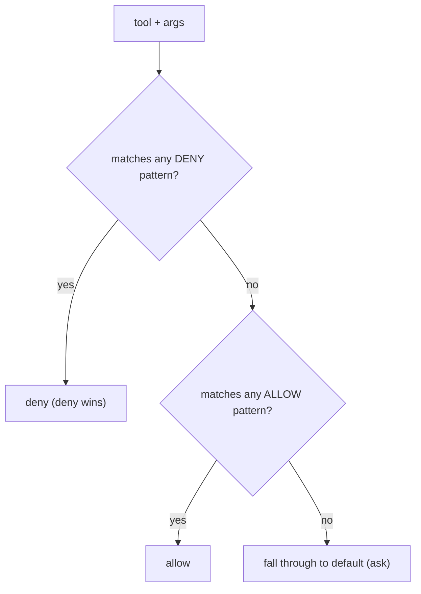

# Allowlists, Denylists & Pattern Matching

> **Motto** — Deny wins over allow, and the most specific rule wins — make precedence explicit.

*Part of Phase 08 — Permissions & Safety Gating.*

## The Problem

"Allow `git` but deny `git push`." "Allow reads anywhere but deny writing to `/etc`." Rules
overlap and conflict, and if precedence is fuzzy you get surprises — an allow rule silently
permitting something a deny rule meant to block. You need pattern-based allow/deny lists
with a clear, documented precedence: **deny always wins**, and specificity breaks ties.

## The Concept



## Build It

`code/policy.py` — glob-style pattern rules with deny-wins precedence:

```python
import fnmatch

class PolicyList:
    def __init__(self, allow=(), deny=()):
        self.allow, self.deny = list(allow), list(deny)

    def _match(self, patterns, signature):
        return any(fnmatch.fnmatch(signature, p) for p in patterns)

    def decide(self, signature):           # signature e.g. "bash:git push origin main"
        if self._match(self.deny, signature):
            return "deny"                  # deny always wins
        if self._match(self.allow, signature):
            return "allow"
        return "ask"                       # fall through
```

```python
pol = PolicyList(allow=["bash:git *", "read:*"], deny=["bash:git push*", "write:/etc/*"])
print(pol.decide("bash:git status"))       # allow
print(pol.decide("bash:git push origin"))  # deny (deny wins over the git * allow)
print(pol.decide("write:/etc/hosts"))      # deny
print(pol.decide("write:/tmp/x"))          # ask (no match)
```

Deny-wins is the safe default: an allow rule can never accidentally re-permit something a
deny rule blocked.

## Use It

This is how Claude Code's `permissions.allow` / `permissions.deny` in `settings.json` work
(e.g. `Bash(git push:*)` in deny), and Codex's command rules. You write broad allows for
safe families and narrow denies for the dangerous specifics — confident that deny wins.

## Ship It

[`code/policy.py`](../../02-allow-deny/code/policy.py) — pattern allow/deny lists with
deny-wins precedence.

## Check Yourself

**Q1.** An allow rule and a deny rule both match. Which wins?

- A) allow
- B) deny — deny always wins, so a block can't be accidentally re-permitted
- C) the first listed
- D) the longer pattern

<details><summary>Answer</summary>B — deny-wins is the safe precedence.</details>

**Q2.** No rule matches. The decision should…

- A) allow
- B) fall through to the default mode (ask/deny)
- C) deny everything
- D) error

<details><summary>Answer</summary>B — fall through to the configured default.</details>

**Challenge.** Add specificity tie-breaking among *allow* rules (longer/more-specific
pattern wins) and show a case where it matters.

## Related

- Builds on: [Permission modes](../../01-permission-modes/docs/en.md)
- Next: [Pre/post tool-use hooks](../../03-hooks/docs/en.md)
- [Roadmap](../../../../ROADMAP.md)
