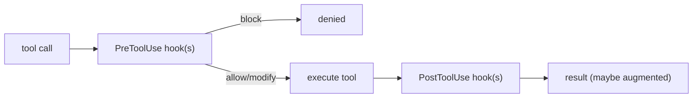

# Pre/Post tool-use hooks

> **Motto** — Hooks let deterministic code run before and after every tool call — no prompt required.

*Part of Phase 08 — Permissions & Safety Gating.*

## The Problem

Some rules must be *guaranteed*, not merely requested of the model: "never edit `.env`",
"run the linter after every write", "redact secrets from output". You can't trust a prompt
for these (Phase 0 lesson 03). **Hooks** are the mechanism: deterministic scripts the harness
runs *around* each tool call — a PreToolUse hook can block or modify a call; a PostToolUse
hook can react to the result.

## The Concept



Pre-hooks gate and rewrite inputs; post-hooks observe and augment outputs (e.g. inject lint
violations into context).

## Build It

`code/hooks.py` — a hook runner with pre (can block) and post (can augment) phases:

```python
class HookRunner:
    def __init__(self):
        self.pre, self.post = [], []      # callables

    def on_pre(self, fn): self.pre.append(fn)
    def on_post(self, fn): self.post.append(fn)

    def call(self, tool, args, execute):
        for hook in self.pre:
            verdict = hook(tool, args)     # return ("deny", msg) or ("allow", args)
            if verdict[0] == "deny":
                return f"blocked: {verdict[1]}"
            args = verdict[1]
        result = execute(tool, args)
        for hook in self.post:
            result = hook(tool, args, result)
        return result
```

```python
hr = HookRunner()
hr.on_pre(lambda t, a: ("deny", ".env is protected")
          if a.get("path", "").endswith(".env") else ("allow", a))
hr.on_post(lambda t, a, r: r + "  [lint: ok]" if t == "write" else r)
print(hr.call("write", {"path": ".env"}, execute=lambda t, a: "wrote"))   # blocked
print(hr.call("write", {"path": "app.py"}, execute=lambda t, a: "wrote")) # wrote [lint: ok]
```

Pre-hooks are your enforcement layer (block `.env`); post-hooks are your reaction layer
(run the linter, inject its output) — both deterministic, both prompt-free.

## Use It

This is the Claude Code **hooks** system in `settings.json` (`PreToolUse`, `PostToolUse`,
and more) — exactly where the `.env` guard (Phase 0) and tool budgets (Phase 3) and egress
guard (Phase 7) plug in. Codex offers comparable lifecycle hooks. A PostToolUse linter hook
that injects violations into context is the canonical "lint as a teaching tool" pattern.

## Ship It

[`code/hooks.py`](../../03-hooks/code/hooks.py) — a pre/post tool-use hook runner.

## Check Yourself

**Q1.** What can a PreToolUse hook do that a prompt instruction can't?

- A) be polite
- B) deterministically block or rewrite a call before it runs
- C) use fewer tokens
- D) nothing

<details><summary>Answer</summary>B — guaranteed enforcement, not persuasion.</details>

**Q2.** A linter that injects violations into context after a write is a…

- A) PreToolUse hook
- B) PostToolUse hook
- C) permission mode
- D) prompt

<details><summary>Answer</summary>B — it reacts to the result.</details>

**Challenge.** Add a PostToolUse hook that redacts anything matching an API-key pattern from
tool output (a preview of Phase 17 secret redaction).

## Related

- Builds on: [Permission modes](../../01-permission-modes/docs/en.md); Phase 0 — [.env hook](../../../00-setup-and-tooling/03-secrets-and-env/docs/en.md)
- Next: [Human-in-the-loop approval flows](../../04-approvals/docs/en.md)
- [Roadmap](../../../../ROADMAP.md)
