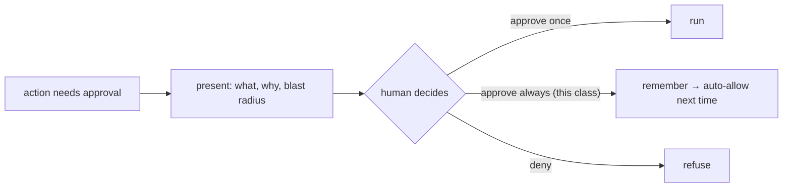

# Human-in-the-Loop Approval Flows

> **Motto** — For the actions that matter, the human is a required step — not an afterthought.

*Part of Phase 08 — Permissions & Safety Gating.*

## The Problem

When the gate says "ask" (lesson 01), the harness needs an actual **approval flow**: present
the pending action clearly, capture a decision, and remember it (so the agent doesn't ask
the same class of thing five times). Done badly, approvals are either skipped (unsafe) or
constant (annoying). Done well, they spend human attention only on genuine decision points.

## The Concept



The "approve always for this class" option is what keeps you from re-approving the same safe
pattern — the harness learns the allow rule from your decision.

## Build It

`code/approvals.py` — an approval flow with remembered decisions:

```python
class Approvals:
    def __init__(self, decide):
        self.decide = decide               # (action_class, detail) -> "once"|"always"|"deny"
        self.always = set()

    def request(self, action_class, detail):
        if action_class in self.always:
            return True                    # remembered
        choice = self.decide(action_class, detail)
        if choice == "always":
            self.always.add(action_class)
            return True
        return choice == "once"
```

```python
# auto-approver for the demo: "always" for git, "deny" for rm
ap = Approvals(decide=lambda cls, d: "always" if cls == "git" else "deny")
print(ap.request("git", "git commit"))   # True (and remembered)
print(ap.request("git", "git push"))     # True (no re-ask — remembered)
print(ap.request("rm", "rm -rf build"))  # False
```

"Approve always" promotes a one-time decision into a standing allow (lesson 02) — the human
teaches the policy by using it.

## Use It

This is the Claude Code / Codex approval prompt: when the agent proposes a gated action, you
choose yes / no / "yes and don't ask again for this", and the tool remembers the last option
as a session (or persisted) allow rule. The orchestration version of this is the wave
approval gate from Phase 10 (spec-first, hard-stop between waves).

## Ship It

[`code/approvals.py`](../../04-approvals/code/approvals.py) — an approval flow with remembered
"always" decisions.

## Check Yourself

**Q1.** What does "approve always for this class" do?

- A) nothing
- B) promotes the decision into a standing allow so the same safe action isn't re-asked
- C) disables permissions
- D) denies future calls

<details><summary>Answer</summary>B — it learns an allow rule from your choice.</details>

**Q2.** Approvals should be spent on…

- A) every tool call
- B) genuine decision points (irreversible/risky actions), not routine ones
- C) reads
- D) nothing

<details><summary>Answer</summary>B — reserve human attention for real decisions.</details>

**Challenge.** Persist the `always` set to disk so remembered approvals survive across
sessions (and add a way to revoke one).

## Related

- Builds on: [Permission modes](../../01-permission-modes/docs/en.md), [Allow/deny](../../02-allow-deny/docs/en.md)
- Next: [Least privilege & capability scoping](../../05-least-privilege/docs/en.md)
- Related: Phase 10 — wave approval gates
- [Roadmap](../../../../ROADMAP.md)
