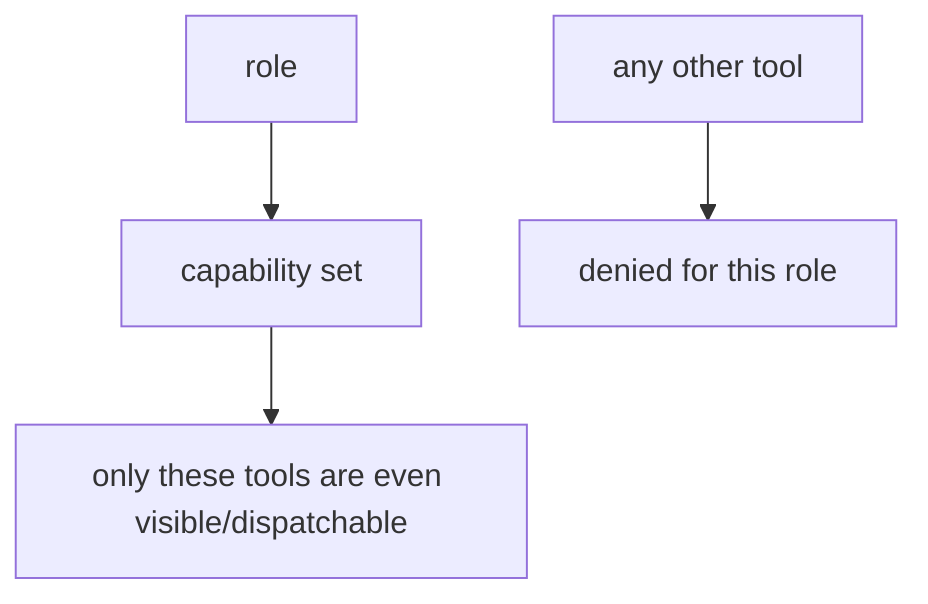

# Least privilege & capability scoping

> **Motto** — Give each agent the smallest set of tools its job needs — nothing more.

*Part of Phase 08 — Permissions & Safety Gating.*

## The Problem

A reviewer subagent doesn't need to write files or run shell commands; a doc-summarizer
doesn't need network access. Granting every agent every capability maximizes blast radius:
one confused or hijacked agent can do anything. Least privilege scopes each agent to a
capability set matched to its role — the security counterpart of the bounded-roles context
rule from Phase 10.

## The Concept



Capabilities compose with the tool registry (Phase 3 L8): a role sees and can call only its
granted tools.

## Build It

`code/least_privilege.py` — role→capability scoping over a tool set:

```python
ROLE_CAPS = {
    "reader":   {"read", "grep", "glob"},
    "coder":    {"read", "grep", "glob", "edit", "write", "bash"},
    "reviewer": {"read", "grep", "glob"},            # never write/bash — judges the diff
    "summarizer": {"read"},
}

class ScopedAgent:
    def __init__(self, role, registry_dispatch):
        self.caps = ROLE_CAPS[role]
        self.dispatch = registry_dispatch

    def call(self, tool, args):
        if tool not in self.caps:
            return f"denied: role lacks capability '{tool}'"
        return self.dispatch(tool, args)
```

```python
dispatch = lambda t, a: f"ran {t}"
rev = ScopedAgent("reviewer", dispatch)
print(rev.call("read", {}))      # ran read
print(rev.call("write", {}))     # denied: role lacks capability 'write'
```

A reviewer literally cannot write or run shell — not by instruction, but by capability. That
makes "the reviewer modified the code it was reviewing" impossible.

## Use It

In Claude Code / Codex this maps to per-subagent tool allowlists (you specify which tools a
spawned subagent may use) and to the `permissions` scoping in `settings.json`. When you
define a custom subagent, grant it the minimum: an Explore agent gets read/search only; a
fixer gets edit/bash. Least privilege + bounded context (Phase 10) is the full isolation
story.

## Ship It

[`code/least_privilege.py`](../../05-least-privilege/code/least_privilege.py) — role→capability
scoping for agents.

## Check Yourself

**Q1.** Why give a reviewer agent no write/bash capability?

- A) speed
- B) so it can't modify what it's judging — impossible by capability, not by instruction
- C) cost
- D) no reason

<details><summary>Answer</summary>B — least privilege removes the ability, not just the
permission.</details>

**Q2.** Capability scoping composes with…

- A) nothing
- B) the tool registry (Phase 3) and bounded-role context (Phase 10)
- C) the model size
- D) temperature

<details><summary>Answer</summary>B — registry visibility + context bounding + capability
scoping.</details>

**Challenge.** Add a `network` capability and scope it so only a dedicated "fetcher" role
can make outbound calls (ties to Phase 7 egress).

## Related

- Builds on: [Allow/deny](../../02-allow-deny/docs/en.md); Phase 3 — [Tool registry](../../../03-tool-engineering/08-tool-registry/docs/en.md)
- Next: [Use It: settings.json & the hooks system](../../06-settings-json/docs/en.md)
- Related: Phase 10 — bounded roles
- [Roadmap](../../../../ROADMAP.md)
