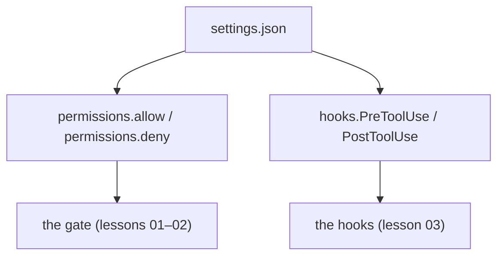

# Use it: settings.json & the hooks system

> **Motto** — Everything you built this phase is configuration — declare it in settings.json.

*Part of Phase 08 — Permissions & Safety Gating. Completes the phase.*

## The Problem

You've built permission modes, allow/deny lists, hooks, approvals, and capability scoping
from scratch. In Claude Code / Codex you don't re-implement these — you **declare** them.
The artifact that ties the phase together is a real `settings.json` (Claude Code) wiring
permission rules and hooks, so the safety layer is version-controlled config, not code you
maintain.

## The Concept



`permissions` encodes the allow/deny lists; `hooks` wires the deterministic pre/post scripts
(the `.env` guard, the linter, the egress guard).

## Build It / Use It

The artifact is `outputs/settings.json` — a ready-to-use Claude Code config that wires this
phase's safety layer:

```json
{
  "permissions": {
    "allow": ["Read(*)", "Grep(*)", "Glob(*)", "Bash(git status:*)", "Bash(npm test:*)"],
    "deny":  ["Bash(rm -rf:*)", "Bash(git push:*)", "Edit(.env)", "Read(.env)"]
  },
  "hooks": {
    "PreToolUse": [
      {"matcher": "Edit|Write", "hooks": [{"type": "command", "command": ".claude/hooks/block-env-edit.sh"}]},
      {"matcher": "Bash", "hooks": [{"type": "command", "command": ".claude/hooks/egress-guard.sh"}]}
    ],
    "PostToolUse": [
      {"matcher": "Edit|Write", "hooks": [{"type": "command", "command": ".claude/hooks/lint.sh"}]}
    ]
  }
}
```

Drop it at `.claude/settings.json`, put the hook scripts (from Phase 0/7) under
`.claude/hooks/`, and the gate + hooks you built by hand are now enforced by the tool.
Codex uses its own config file for the equivalent approval and command rules.

## Use It

This is the practical payoff of the phase for a Claude Code / Codex user: a checked-in
config that makes your agent safe-by-default on this repo — reads flow, dangerous commands
are denied, `.env` is protected, the linter runs after every edit. Because it's a file, it's
reviewable and shareable with your team.

## Ship It

[`outputs/settings.json`](../../06-settings-json/outputs/settings.json) — a Claude Code
permissions + hooks configuration wiring the phase.

## Check Yourself

**Q1.** Where do the allow/deny lists and hooks live for Claude Code?

- A) in the prompt
- B) in `settings.json` (`permissions` and `hooks`)
- C) in the model
- D) nowhere

<details><summary>Answer</summary>B — declarative config, version-controlled.</details>

**Q2.** Why is config-as-a-file better than enforcing rules in a prompt?

- A) it's shorter
- B) it's deterministic, reviewable, shareable, and can't be talked around
- C) it's faster
- D) no reason

<details><summary>Answer</summary>B — config is enforcement; prompts are
persuasion.</details>

**Challenge.** Add a `permissions.deny` entry for writing anywhere outside the repo, and a
PostToolUse hook that runs the test suite after edits to `src/`.

## Related

- Builds on: the whole phase
- Phase complete → next: Phase 9 — [Memory & Persistence](../../../../ROADMAP.md)
- [Roadmap](../../../../ROADMAP.md)
