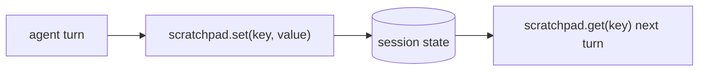

# Session state & the scratchpad

> **Motto** — Give the agent a place to write down what it must not forget mid-task.

*Part of Phase 09 — Memory & Persistence.*

## The Problem

Within a single task the agent accumulates facts it needs to remember: the file it's
editing, a value it computed, a decision it made. Re-deriving these every turn wastes tokens
and invites drift. A **scratchpad** is a small key/value store the harness keeps for the
session — the agent writes notes, reads them back, and they survive across turns without
bloating the conversation.

## The Concept



The scratchpad is *structured* state (distinct from the message history): durable for the
session, queryable by key, and cheap to keep out of the context until needed.

## Build It

`code/scratchpad.py` — a session scratchpad:

```python
class Scratchpad:
    def __init__(self):
        self._d = {}

    def set(self, key, value):
        self._d[key] = value
        return f"noted {key}"

    def get(self, key, default=None):
        return self._d.get(key, default)

    def summary(self):
        return "\n".join(f"- {k}: {v}" for k, v in self._d.items()) or "(empty)"
```

```python
sp = Scratchpad()
sp.set("editing", "api/routes.py")
sp.set("tests_pass", False)
print(sp.get("editing"))      # api/routes.py
print(sp.summary())
```

Expose `set`/`get` as tools and the agent manages its own working memory; `summary()` can be
injected into context when the agent needs a refresher.

## Use It

In Claude Code / Codex this maps to the **todo/plan list** the agent maintains (Phase 11)
and to scratch notes it keeps in the working directory (e.g. a `NOTES.md` or the per-task
`checkpoint.md` from Phase 10). The principle: durable working state lives in the harness, not
in the model's head — so it survives turns and compaction.

## Ship It

[`code/scratchpad.py`](../../01-scratchpad/code/scratchpad.py) — a session scratchpad
(set/get/summary).

## Check Yourself

**Q1.** Why keep working facts in a scratchpad instead of re-deriving them each turn?

- A) it's prettier
- B) re-derivation wastes tokens and risks drift; the scratchpad is cheap durable state
- C) the API requires it
- D) no reason

<details><summary>Answer</summary>B — structured state beats re-deriving.</details>

**Q2.** How is the scratchpad different from message history?

- A) it isn't
- B) it's structured key/value state, queryable and kept out of context until needed
- C) it's bigger
- D) it's the system prompt

<details><summary>Answer</summary>B — structured, not a transcript.</details>

**Challenge.** Add a `tools`-exposed `note(key, value)` and have the loop inject
`summary()` only when the scratchpad changed since last turn.

## Related

- Builds on: Phase 2 — [Turn history](../../../02-the-agent-loop/04-turn-history/docs/en.md)
- Next: [Persisting & resuming conversations](../../02-persist-resume/docs/en.md)
- Related: Phase 11 — Task management
- [Roadmap](../../../../ROADMAP.md)
