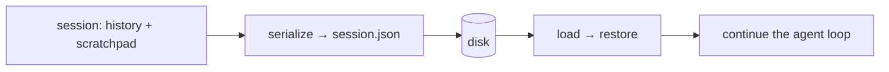

# Persisting & Resuming Conversations

> **Motto** — A session you can save is a session you can resume — don't lose work to a closed terminal.

*Part of Phase 09 — Memory & Persistence.*

## The Problem

Close the terminal, hit a crash, or come back tomorrow — and the conversation is gone unless
the harness persisted it. Resuming means restoring the message history (Phase 2 lesson 04)
and the scratchpad (lesson 01) so the agent continues where it left off. The serialization
has to round-trip cleanly, including tool-call pairing.

## The Concept



## Build It

`code/session_store.py` — save/load a full session:

```python
import json, os

class SessionStore:
    def __init__(self, path):
        self.path = path

    def save(self, history, scratch):
        with open(self.path, "w") as f:
            json.dump({"history": history, "scratch": scratch}, f, indent=2)
        return f"saved {len(history)} messages"

    def load(self):
        if not os.path.exists(self.path):
            return [], {}
        with open(self.path) as f:
            data = json.load(f)
        return data.get("history", []), data.get("scratch", {})
```

```python
import tempfile
store = SessionStore(tempfile.mktemp(suffix=".json"))
store.save([{"role": "user", "content": "hi"}], {"editing": "a.py"})
hist, scratch = store.load()
print(len(hist), scratch)        # 1 {'editing': 'a.py'}
```

Saving after each turn (or each tool call) makes the session crash-resilient; loading on
start resumes it exactly.

## Use It

This is Claude Code's session resume (`claude --resume` / `--continue`) and Codex's session
history: conversations are persisted so you can pick a prior session back up. On Claude Code
on the web, the container is ephemeral — which is *why* anything worth keeping must be
committed/pushed, and why long state belongs in files, not just the chat.

## Ship It

[`code/session_store.py`](../../02-persist-resume/code/session_store.py) — a session save/load
store.

## Check Yourself

**Q1.** What must a resumable session restore?

- A) only the last message
- B) the message history (with valid tool pairing) and the scratchpad
- C) the system prompt only
- D) nothing

<details><summary>Answer</summary>B — history + working state, intact.</details>

**Q2.** On an ephemeral cloud container, durable state should live…

- A) only in the chat
- B) in files you commit/push (the container is reclaimed)
- C) in memory
- D) nowhere

<details><summary>Answer</summary>B — persist to the repo; the box is temporary.</details>

**Challenge.** Save after every turn and add a `--resume` flag to the Phase 0 REPL that loads
the last session on start.

## Related

- Builds on: [Scratchpad](../../01-scratchpad/docs/en.md); Phase 2 — [Turn history](../../../02-the-agent-loop/04-turn-history/docs/en.md)
- Next: [Long-term memory & retrieval](../../03-long-term-memory/docs/en.md)
- [Roadmap](../../../../ROADMAP.md)
