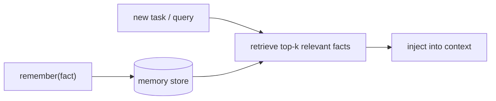

# Long-Term Memory & Retrieval

> **Motto** — Long-term memory is a store you write facts to and retrieve the relevant few from.

*Part of Phase 09 — Memory & Persistence.*

## The Problem

The scratchpad (lesson 01) dies with the session; persisted sessions (lesson 02) are
per-conversation. Some knowledge should outlive both: "this project uses pnpm", "the auth
flow lives in `auth/`", "we decided against Redis". Long-term memory is a durable store the
agent writes such facts to and *retrieves the relevant ones from* on later tasks — without
loading the entire memory into context.

## The Concept



Write is append; read is *retrieval* (relevance-ranked), so context stays lean even as the
store grows. Lexical ranking here; embeddings in Phase 13.

## Build It

`code/long_term.py` — an append-and-retrieve memory store:

```python
import json, os

class LongTermMemory:
    def __init__(self, path):
        self.path = path
        self.facts = json.load(open(path)) if os.path.exists(path) else []

    def remember(self, fact, tags=()):
        self.facts.append({"fact": fact, "tags": list(tags)})
        json.dump(self.facts, open(self.path, "w"))
        return "remembered"

    def retrieve(self, query, k=3):
        q = set(query.lower().split())
        def score(e):
            words = set(e["fact"].lower().split()) | set(e["tags"])
            return len(q & words)
        ranked = sorted(self.facts, key=score, reverse=True)
        return [e["fact"] for e in ranked[:k] if score(e) > 0]
```

```python
import tempfile
m = LongTermMemory(tempfile.mktemp(suffix=".json"))
m.remember("This project uses pnpm, not npm.", tags=["build"])
m.remember("Auth flow lives in auth/.", tags=["auth"])
print(m.retrieve("how do I build"))     # ['This project uses pnpm, not npm.']
```

The agent calls `remember` when it learns something durable, and the harness calls
`retrieve` to surface the few relevant facts per task — not the whole store.

## Use It

This is the pattern behind project memory that persists beyond one chat: a `knowledge.md`
(the append-only system of record from the harness principles), per-user memory, or a
dedicated **memory MCP server** (lesson 05) that Claude Code / Codex query each session. The
key discipline: retrieve relevant facts, don't dump the whole memory into `CLAUDE.md`.

## Ship It

[`code/long_term.py`](../../03-long-term-memory/code/long_term.py) — an append-and-retrieve
long-term memory store.

## Check Yourself

**Q1.** Why *retrieve* from long-term memory rather than load all of it?

- A) it's faster to load all
- B) the store grows; retrieving the relevant few keeps context lean
- C) the API requires it
- D) no reason

<details><summary>Answer</summary>B — retrieval keeps context small as memory grows.</details>

**Q2.** When should the agent call `remember`?

- A) every turn
- B) when it learns a durable fact worth carrying to future tasks
- C) never
- D) only on errors

<details><summary>Answer</summary>B — persist durable knowledge, not transient
chatter.</details>

**Challenge.** Replace lexical scoring with embedding similarity (Phase 13) and dedupe
near-identical facts on `remember`.

## Related

- Builds on: [Persist & resume](../../02-persist-resume/docs/en.md)
- Next: [Compaction across sessions](../../04-cross-session-compaction/docs/en.md)
- Deepens in: Phase 13 — Retrieval
- [Roadmap](../../../../ROADMAP.md)
