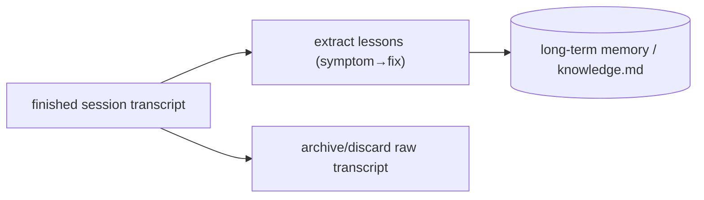

# Compaction across sessions

> **Motto** — Distill finished sessions into durable lessons — keep the insight, drop the transcript.

*Part of Phase 09 — Memory & Persistence.*

## The Problem

In-session compaction (Phase 4 lesson 04) shrinks one conversation. But across many
sessions you accumulate transcripts you'll never re-read — yet they contain hard-won lessons
("the flaky test is a timing issue", "don't bump that dep"). Cross-session compaction
extracts those lessons into long-term memory (lesson 03) so the *knowledge* persists while
the raw transcripts can be archived or discarded.

## The Concept



This is the harness-principles "persistent cross-sprint memory": append precise lessons
(symptom, root cause, fix) — evidence, not vague summaries.

## Build It

`code/distill.py` — distill a session into memory entries:

```python
def distill(transcript, remember):
    """Extract durable lessons from a transcript and write them to memory.
    `extract` is a model call in production; here it's a simple heuristic."""
    lessons = []
    for msg in transcript:
        text = msg.get("content", "")
        if isinstance(text, str) and ("fix:" in text.lower() or "lesson:" in text.lower()):
            lessons.append(text.strip())
    for lesson in lessons:
        remember(lesson, tags=["lesson"])
    return f"distilled {len(lessons)} lesson(s)"
```

```python
saved = []
transcript = [{"role": "assistant", "content": "Fix: the flaky test needs a 200ms wait."},
              {"role": "assistant", "content": "Did some refactoring."}]
print(distill(transcript, remember=lambda f, tags: saved.append(f)))   # distilled 1
print(saved)
```

In production `distill` is a model call ("extract durable lessons as symptom→fix") writing to
`LongTermMemory` or `knowledge.md`. The transcript can then be archived; the lesson endures.

## Use It

This is the **memory agent** from the harness-principles pipeline (Phase 10): after a sprint,
it appends precisely-worded failure patterns to `knowledge.md`. For a Claude Code / Codex
user, the lightweight version is ending a session by asking the agent to "append what we
learned to `knowledge.md`", so the next session starts smarter without re-reading old chats.

## Ship It

[`code/distill.py`](../../04-cross-session-compaction/code/distill.py) — a session→memory
distiller.

## Check Yourself

**Q1.** What does cross-session compaction keep, and what does it drop?

- A) keeps the transcript, drops the lessons
- B) keeps the distilled lessons (symptom→fix), drops/archives the raw transcript
- C) keeps everything
- D) drops everything

<details><summary>Answer</summary>B — keep insight, shed transcript.</details>

**Q2.** A good distilled lesson is…

- A) "the session went well"
- B) precise: symptom, root cause, fix
- C) the full transcript
- D) a token count

<details><summary>Answer</summary>B — evidence, not vague summary.</details>

**Challenge.** Make `distill` a real model call that returns structured `{symptom, cause,
fix}` entries and dedupe against existing memory before writing.

## Related

- Builds on: [Long-term memory](../../03-long-term-memory/docs/en.md); Phase 4 — [Compaction](../../../04-context-engineering/04-compaction/docs/en.md)
- Next: [Use It: a memory MCP server](../../05-memory-mcp/docs/en.md)
- Related: Phase 10 — memory agent / knowledge.md
- [Roadmap](../../../../ROADMAP.md)
