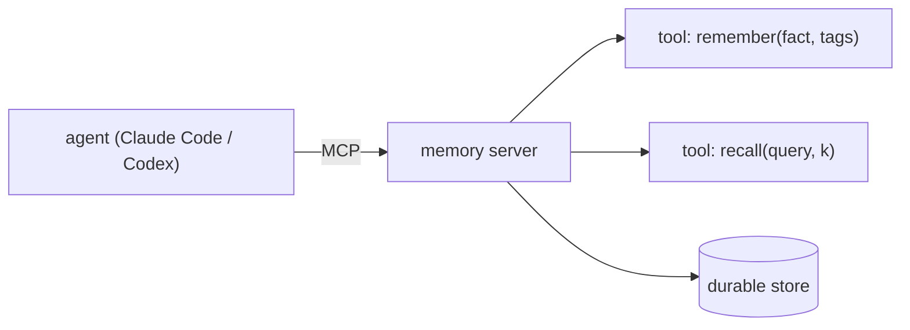

# Use It: A Memory MCP Server

> **Motto** — Expose memory as an MCP server and any agent — Claude Code or Codex — can use it.

*Part of Phase 09 — Memory & Persistence. Completes the phase.*

## The Problem

You've built scratchpad, persistence, long-term memory, and distillation as Python modules.
To make them usable from a *real* agent, they need to be reachable as **tools** the agent can
call. The clean, portable way is the Model Context Protocol (MCP): wrap memory in an MCP
server exposing `remember` and `recall`, and Claude Code / Codex can connect to it and use it
every session. (You build MCP from scratch in Phase 12; here you see why memory is a natural
MCP server.)

## The Concept



Memory-as-a-server means it's shared across sessions and across tools, and survives the
ephemeral agent process.

## Build It / Use It

The real server uses the MCP SDK (Phase 12). `code/memory_server.py` shows the tool layer
over the Phase 9 store — a plain class whose methods are the MCP tools, so the logic is
testable without a transport:

```python
class MemoryServer:
    """The tool surface a memory MCP server exposes (transport added in Phase 12)."""
    def __init__(self, store):
        self.store = store                 # LongTermMemory from lesson 03

    def remember(self, fact, tags=None):
        return self.store.remember(fact, tags or [])

    def recall(self, query, k=3):
        return self.store.retrieve(query, k)

    def tools(self):
        return [
            {"name": "remember", "description": "Save a durable fact.",
             "input_schema": {"type": "object",
                "properties": {"fact": {"type": "string"}, "tags": {"type": "array"}},
                "required": ["fact"]}},
            {"name": "recall", "description": "Retrieve relevant facts.",
             "input_schema": {"type": "object",
                "properties": {"query": {"type": "string"}, "k": {"type": "integer"}},
                "required": ["query"]}},
        ]
```

```python
class Mem:                       # stand-in store
    def __init__(self): self.f = []
    def remember(self, fact, tags): self.f.append(fact); return "ok"
    def retrieve(self, q, k): return [x for x in self.f if any(w in x for w in q.split())][:k]

s = MemoryServer(Mem())
s.remember("Project uses pnpm.")
print(s.recall("pnpm"))         # ['Project uses pnpm.']
print([t["name"] for t in s.tools()])   # ['remember', 'recall']
```

In Phase 12 you wrap this exact surface in the MCP wire protocol; here the point is that
memory is just two tools over a durable store.

## Use It

This is exactly a **memory MCP server** you add to Claude Code / Codex (e.g. via
`.mcp.json` / MCP config): the agent gains `remember` and `recall` tools and carries
knowledge across sessions. It's the productized form of everything in this phase — and a
real, popular category of MCP server.

## Ship It

[`code/memory_server.py`](../../05-memory-mcp/code/memory_server.py) — the tool surface of a
memory MCP server.

## Check Yourself

**Q1.** Why expose memory as an MCP server?

- A) it's trendy
- B) any MCP client (Claude Code/Codex) can then use it, shared across sessions and tools
- C) it's faster
- D) no reason

<details><summary>Answer</summary>B — portable, shared, persistent memory.</details>

**Q2.** A memory server's core tools are…

- A) read and write files
- B) `remember` (save a fact) and `recall` (retrieve relevant facts)
- C) start and stop
- D) login and logout

<details><summary>Answer</summary>B — write and relevance-read.</details>

**Challenge.** After Phase 12, wrap this `MemoryServer` in the MCP protocol and connect it to
your agent so `recall` runs at the start of each task.

## Related

- Builds on: the whole phase
- Built into a server in: Phase 12 — [MCP & Extensibility](../../../../ROADMAP.md)
- Phase complete → next: Phase 11 — [Planning & Task Management](../../../../ROADMAP.md)
- [Roadmap](../../../../ROADMAP.md)
