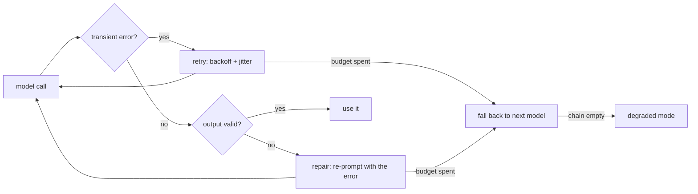

# The failure ladder: retry, repair, fall back

> **Motto** — Match each failure to the cheapest fix: wait for a blip, correct bad output, switch model.

*Part of Phase 09 — Reliability, Evals and Ops.*

*Last reviewed: 2026-10 · Volatility: fast*

## The Problem

Model calls fail in three different ways. The network or provider fails: a rate limit, an overload, a dropped connection. The model answers, but the answer breaks its contract: bad JSON, a missing field. Or the model you chose is down or too weak for the task.

One fix does not cover all three. Retrying bad JSON just repeats the mistake. Switching models on a one-second blip wastes money. Retrying instantly in lockstep with other clients makes an overload worse.

A harness needs a ladder. Each rung handles one failure class. The cheapest rung runs first.

## The Concept



- **Retry** fixes transport failures. Delay grows as `base * 2^n`. **Jitter** adds a random extra wait so many clients do not retry together.
- **Repair** fixes content failures. The validator's error text goes back to the model.
- **Fallback** fixes a bad choice of model. **Routing** picks the first model by fit. The rest of the list is the fallback order.

Every rung has a limit. When the last rung fails, the run ends in degraded mode (lesson 2).

## Build It

`code/ladder.py` has one function per rung. Retry only catches `Transient`. Any other error, such as a 400, fails at once because it will not fix itself. The sleep function is injected, so tests run without waiting.

```python
def retry(call, max_attempts=4, base=0.5, cap=8.0, sleep=lambda s: None, rng=random):
    """Retry Transient errors with exponential backoff plus jitter. Anything else fails fast."""
    for attempt in range(max_attempts):
        try:
            return call()
        except Transient:
            if attempt == max_attempts - 1:
                raise
            sleep(min(cap, base * 2 ** attempt) + rng.uniform(0, base))
```

The repair loop passes the validator's message to the next attempt.

```python
def repair_loop(generate, validate, max_attempts=3):
    """generate(feedback) -> output; validate(output) -> None or an error message."""
    feedback, err = None, None
    for attempt in range(max_attempts):
        out = generate(feedback)
        err = validate(out)
        if err is None:
            return {"ok": True, "output": out, "attempts": attempt + 1}
        feedback = f"Your output was invalid: {err}. Return only the corrected output."
    return {"ok": False, "error": err, "attempts": max_attempts}
```

`climb` nests the rungs. Retry runs inside repair, and repair runs inside the fallback chain.

```python
def climb(chain, call_model, validate, sleep=lambda s: None):
    """Retry inside repair, repair inside fallback: each rung handles one failure class."""
    def attempt(model):
        out = repair_loop(
            lambda feedback: retry(lambda: call_model(model, feedback), sleep=sleep), validate)
        if not out["ok"]:
            raise ValueError(out["error"])
        return out
    return with_fallback(chain, attempt)
```

The asserts at the end of the file check the numbers. A model that is always overloaded gets 4 attempts, then the chain moves on. The next model needs one repair round and succeeds on its second try.

Retries are only safe for calls that can repeat. A call that sends an email needs the idempotency key from [lesson 2](../../02-budgets-idempotency-degraded-mode/docs/en.md).

## Use It

The Anthropic Python SDK retries connection errors, 408, 409, 429, and 5xx responses 2 times by default, with a short exponential backoff. Set `max_retries` on the client to change that. The SDK raises `RateLimitError`, `APIConnectionError`, `InternalServerError`, and other subclasses of `APIError`.

`code/ladder_sdk.py` sets `max_retries=0` so your ladder owns every retry. Otherwise attempts multiply: your 4 times the SDK's 3. It maps the transient error types to `Transient` and lets 400-class errors pass through. The model comes from one `HARNESS_MODEL` variable. An optional `HARNESS_FALLBACK_MODEL` adds a second rung.

Claude Code has the same idea built in. The `--fallback-model` flag takes a comma-separated list of models. Claude Code tries them in order when the primary model is overloaded or unavailable.

## Challenge

Add a circuit breaker. After 3 failures in a row, `with_fallback` should skip a model for 60 seconds instead of retrying it on every request. Use an injected clock so the test needs no sleep.

## Sources

[Anthropic Python SDK: errors and retries](https://platform.claude.com/docs/en/api/sdks/python) · [Claude Code CLI reference](https://code.claude.com/docs/en/cli-reference)

Other track: [Reliability and failure](../../../../../technical-product-sense/reliability-and-failure.md) · Next: [Budgets, idempotency and degraded mode](../../02-budgets-idempotency-degraded-mode/docs/en.md)
