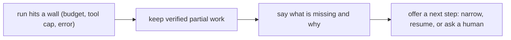

# Budgets, idempotency, and degraded mode

> **Motto** — Cap the worst case, never act twice, and when you must stop, say exactly where you stopped.

*Part of Phase 09 — Reliability, Evals and Ops.*

*Last reviewed: 2026-10 · Volatility: fast*

## The Problem

A confused agent can loop forever or call one tool 200 times. A retry can send the same email twice. And when the run does fail, a crash or a false "done" is the worst answer the user can get.

Three guards cover this. A **budget** sets a hard ceiling on steps, tokens, and dollars. **Idempotency** makes a repeated side effect harmless. **Degraded mode** turns a stop into an honest, partial result.

Without them, the worst case is unknown. With them, you know the most a request can cost and what it can break.

## The Concept



Every spend goes through a check first. Three rules apply:

1. **Many meters.** Count steps, tokens, dollars, and tool calls. Any one meter can stop the run.
2. **Never auto-extend.** A hit budget stops the run. Only a human raises it.
3. **Never fake success.** The outcome is `complete`, `degraded`, or `failed`. Only verified work counts as done.

An **idempotency key** comes from the call's intent: the tool name plus its arguments. The same key always returns the stored result instead of acting again.

## Build It

`code/guards.py` holds the three guards. `Budget` tracks several meters. `exceeded()` lists every meter that hit its limit.

```python
    def charge(self, steps=0, tokens=0, usd=0.0):
        self.spent["steps"] += steps
        self.spent["tokens"] += tokens
        self.spent["usd"] += usd

    def exceeded(self):
        return [k for k in self.limits if self.spent[k] >= self.limits[k]]
```

`ToolBudget` limits one step that fires many calls. It caps the total and the rate. The clock is a parameter, so tests need no sleep.

```python
    def allow(self, now):
        self.calls = [t for t in self.calls if now - t < self.window_s]
        if self.total >= self.max_total:
            return False, "total tool budget exhausted"
        if len(self.calls) >= self.per_window:
            return False, f"rate limit: max {self.per_window} per {self.window_s}s"
        self.calls.append(now)
        self.total += 1
        return True, None
```

When a call is denied, send the reason to the model as the tool result. The model can then wrap up instead of crashing.

`Idempotent` and `key_for` dedupe by intent:

```python
def key_for(tool, args):
    """Derive the key from intent: same tool and args give the same key."""
    blob = json.dumps([tool, args], sort_keys=True)
    return hashlib.sha256(blob.encode()).hexdigest()[:16]
```

This store lives in memory and only blocks repeats of a call that finished. If a call times out and you do not know whether it ran, the store cannot help. Pass the key to the remote service so it can dedupe. Many payment APIs, such as Stripe's, accept an `Idempotency-Key` header for this reason. Stripe has the caller generate a random key per operation. A hash of the tool and its arguments, as used here, also blocks a deliberate second identical call. Choose one on purpose.

`code/degraded.py` runs a list of steps and keeps what it verified:

```python
def run_with_degrade(steps, do_step, budget):
    """Run steps in order. Return complete, degraded, or failed, and always keep verified work."""
    done = []
    for step in steps:
        hit = budget.exceeded()
        if hit:
            return {"status": "degraded", "done": done, "remaining": steps[len(done):],
                    "reason": f"budget exhausted: {', '.join(hit)}", "spent": budget.report(),
                    "next": "narrow the scope or raise the budget, then resume"}
```

The asserts check one real case. The token meter trips after 3 of 5 steps. The result lists 3 done, 2 remaining, the reason, and the spend. A step that raises gives `failed` with the earlier work kept.

## Use It

Claude Code has budgets for non-interactive runs. In print mode (`claude -p`), `--max-turns` limits agentic turns and exits with an error when the limit is reached. `--max-budget-usd` stops the run once spend reaches the cap, and subagent spend counts toward it. Both flags work in print mode only.

A tool budget is a `PreToolUse` hook. The hook reads the tool call as JSON on stdin and exits with code 2 to block it. The stderr text becomes the reason the model sees. `ToolBudget` is a model of that hook. It is not Claude Code's own code. [Phase 06](../../../06-permissions-and-security/02-hooks/docs/en.md) covers hooks.

Hold your own agent to the degraded-mode standard. "I edited 3 of 5 files; the other 2 failed type-checking, and here is the error" is a good report. A crash or a false "done" is not.

## Challenge

Give `Idempotent` a time-to-live. After the TTL passes, `run` should execute the action again instead of replaying. Inject the clock, then assert both sides of the boundary.

## Sources

[Claude Code CLI reference](https://code.claude.com/docs/en/cli-reference) · [Claude Code hooks](https://code.claude.com/docs/en/hooks)

Next: [The eval harness](../../03-eval-harness/docs/en.md)
