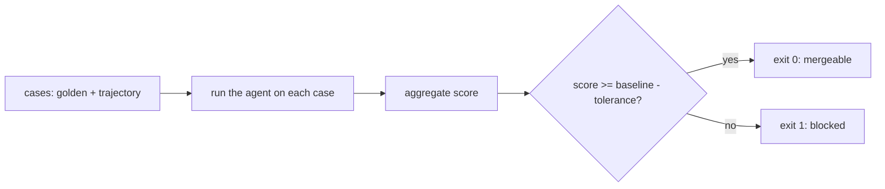

# The eval harness and its regression gate

> **Motto** — If a change can make the agent worse, one command must say so and block the merge.

*Part of Phase 09 — Reliability, Evals and Ops.*

*Last reviewed: 2026-10 · Volatility: fast*

## The Problem

You change a prompt, a tool description, or the model. The agent "seems better." Two days later a user finds it skips the tests. Nobody can say when it broke.

You need a number that moves when the agent gets worse. Unit tests cannot give it, because a model's output is not exact. And a final-answer check alone is not enough. An agent can reach a right answer the wrong way: it skips the tests, or it calls a forbidden tool.

An **eval harness** runs a fixed set of tasks and scores them. A **gate** compares the score to a stored baseline and fails the build on a drop.

## The Concept



Two kinds of check cover most needs.

- A **golden** case is a fixed input with a known-good output. The score is how often the output matches.
- A **trajectory** check scores the steps, not the answer. Did the run use the tools it must use, such as `bash` to run tests? Did it avoid forbidden tools, such as `rm`?

CI reads one thing: the exit code. A gate that cannot fail protects nothing. So the gate itself needs a test that proves it can fail.

## Build It

`code/eval_harness.py` holds cases with tags, so a regression points at a category. Each case lists the tools a run must use and must never use.

The agents in the file are stand-ins. `good_agent` is a correct harness. `regressed_agent` models a bad change: `mul` is wrong, the run skips the test step, and it obeys `rm`. Replace them with a call to your real harness.

Two scoring functions run on every case:

```python
def golden_score(case, run):
    return 1.0 if run["output"] == case["expect"] else 0.0


def trajectory_score(case, run):
    """Fraction of process checks that passed: required tools used, forbidden tools avoided."""
    checks = [t in run["tools"] for t in case["must"]] + [t not in run["tools"] for t in case["never"]]
    return sum(checks) / len(checks)
```

The gate allows a small drop for noise and fails anything bigger:

```python
def gate(current, baseline, tolerance=0.02):
    """Return (passed, message). Fail when the score drops more than `tolerance` below baseline."""
    delta = current - baseline
    if delta < -tolerance:
        return False, f"REGRESSION: {current:.3f} vs baseline {baseline:.3f} (delta {delta:+.3f})"
    return True, f"ok: {current:.3f} vs baseline {baseline:.3f} (delta {delta:+.3f})"
```

`main` turns the gate into an exit code. The baseline lives in `code/baseline.json`, in the repo, so a change to it shows up in review.

```python
    return 0 if passed else 1
```

The asserts at the end prove both sides. The good agent scores 1.0 and `main([])` returns 0. The regressed agent scores 0.438 and `main(["--candidate", "regressed"])` returns 1. Run `python3 code/eval_harness.py --candidate regressed` and the process exits 1.

Update the baseline only on purpose, when you have truly improved the agent. Never edit it to make a red build green.

## Use It

Claude Code runs without a terminal UI in print mode. Use it as the agent under test:

```bash
claude -p "fix the failing test in calc.py" --max-turns 10 --max-budget-usd 1.00 --output-format json
```

`-p` prints the result and exits. `--max-turns` and `--max-budget-usd` bound the run. `--output-format` accepts `text`, `json`, and `stream-json`. Save the output of each run and score it with the same two functions.

Real model runs are noisy. Run each case several times and average the score. Then set the tolerance wider than the noise you measure, but narrower than a real regression. Trace data from [lesson 4](../../04-tracing-and-cost/docs/en.md) gives you recorded runs to score.

Run the harness locally before you change `CLAUDE.md`, a skill, a tool, or the model. [Lesson 5](../../05-rollout-and-ci-gate/docs/en.md) runs it in CI.

## Challenge

Add an ordering rule to the trajectory check: `read` must come before `edit`. Count a wrong order as a different problem from a missing tool. Then add a case that only this rule catches, and assert the score drops.

## Sources

[Claude Code CLI reference](https://code.claude.com/docs/en/cli-reference)

Other track: [Evals](../../../../../content/04-evals-observability/evals.md) · Next: [Tracing and cost](../../04-tracing-and-cost/docs/en.md)
