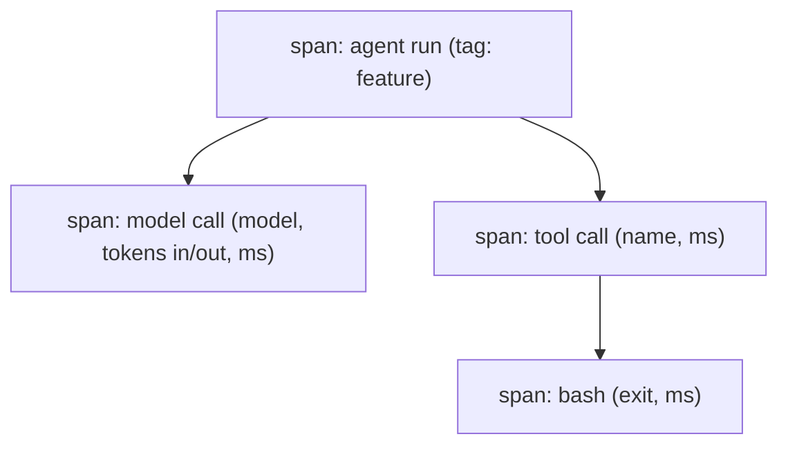

# Tracing and cost

> **Motto** — Record every call as a timed, tagged span, and price every span, so you can say what a run did and what it cost.

*Part of Phase 09 — Reliability, Evals and Ops.*

*Last reviewed: 2026-10 · Volatility: fast*

## The Problem

An agent run can go wrong in three ways. It is slow, it costs too much, or the answer is wrong. When it happens, a log of the final answer tells you nothing about why.

You need to see which steps ran, how long each took, and how many tokens each used. You also need to turn tokens into money and tag the money by feature or tenant. Without that, you cannot say which feature is expensive, and you cannot set a budget that means anything.

A **trace** is the flight recorder. It is a tree of **spans**: the run, each model call, each tool call.

## The Concept



A span has a name, a start and end time, and attributes. Spans nest, so the tree matches the call structure. "Why was this run slow?" becomes "which span took the most time?"

**Cost** is a function of the span's attributes. Price depends on the model and on the direction: input tokens and output tokens have separate rates. Cost rolls up the tree. A child span inherits its parent's tag, so one tag on the run covers every call inside it.

Prices change. Never bury a price in code as if it were a fact. Keep a table you load and version.

## Build It

`code/tracing.py` has a tracer, a price table, and a roll-up. The price table is labelled as an example, with made-up model names:

```python
# EXAMPLE prices in USD per 1M tokens. These are made-up numbers for the demo.
# In a real harness, load the current price list from your provider and version it.
EXAMPLE_PRICES = {
    "example-large": {"in": 10.0, "out": 50.0},
    "example-small": {"in": 1.0, "out": 5.0},
}
```

The tracer is a context manager. A span that raises is still closed, and it records the error. The clock is injected, so the test can use fake times.

```python
    @contextmanager
    def span(self, name, **attrs):
        rec = {"name": name, "attrs": attrs, "children": [], "ms": None}
        (self._stack[-1]["children"] if self._stack else self.roots).append(rec)
        self._stack.append(rec)
        start = self.clock()
        try:
            yield rec
        except Exception as e:
            rec["attrs"]["error"] = repr(e)           # a failed span still lands in the trace
            raise
        finally:
            rec["ms"] = round((self.clock() - start) * 1000, 1)
            self._stack.pop()
```

The roll-up walks the tree, prices each span that has token counts, and sums by tag:

```python
def cost_by_tag(spans, prices=EXAMPLE_PRICES):
    """Add up the cost of every span that has token counts. A child inherits its parent's tag."""
    totals = {}

    def walk(nodes, inherited):
        for s in nodes:
            a = s["attrs"]
            tag = a.get("tag", inherited)
            if "model" in a:
                totals[tag] = totals.get(tag, 0.0) + cost_usd(a["model"], a["in_tokens"], a["out_tokens"], prices)
            walk(s["children"], tag)

    walk(spans, "untagged")
    return {tag: round(total, 6) for tag, total in totals.items()}
```

The asserts use a fake clock to check the durations: 500 ms for the run, 400 for the model call, 100 for the tool. They also check the cost by hand. 10,000 input and 2,000 output tokens on the large example model cost `(10000*10 + 2000*50) / 1e6 = 0.20`. The refactor tag totals 0.24 and the search tag 0.075.

Feed `cost_by_tag` into the `Budget` from [lesson 2](../../02-budgets-idempotency-degraded-mode/docs/en.md), so a spend limit uses real numbers.

## Use It

Real responses carry the token counts. The Anthropic Python SDK exposes them on `message.usage`, with `input_tokens` and `output_tokens`. Put those numbers on your span.

To ship spans to a dashboard, use OpenTelemetry (OTel), the standard tracing API. `code/tracing_sdk.py` emits the same tree with the OTel SDK. It follows a subset of the GenAI attribute names: `gen_ai.operation.name`, `gen_ai.provider.name`, `gen_ai.request.model`, `gen_ai.tool.name`, `gen_ai.usage.input_tokens`, and `gen_ai.usage.output_tokens`. It uses the operation values `chat`, `invoke_agent`, and `execute_tool`. These conventions are still marked "Development", so check the spec before you rely on them.

Claude Code can export its own telemetry. Set `CLAUDE_CODE_ENABLE_TELEMETRY=1` and pick an exporter with `OTEL_METRICS_EXPORTER`, such as `otlp`. It reports metrics including `claude_code.token.usage` and `claude_code.cost.usage`. Traces are in beta and need `CLAUDE_CODE_ENHANCED_TELEMETRY_BETA=1` and `OTEL_TRACES_EXPORTER=otlp`.

## Challenge

Add a cache-read rate to the price table. Make `cost_usd` price cached input tokens at that lower rate. Then assert the saving on a run with a large cached prefix. Use the usage fields your SDK version returns.

## Sources

[OpenTelemetry GenAI semantic conventions](https://github.com/open-telemetry/semantic-conventions-genai) · [Claude Code monitoring](https://code.claude.com/docs/en/monitoring-usage) · [Anthropic Python SDK](https://platform.claude.com/docs/en/api/sdks/python)

Other track: [Cost attribution](../../../../../content/04-evals-observability/cost-attribution.md) · Next: [Rollout and the CI gate](../../05-rollout-and-ci-gate/docs/en.md)
