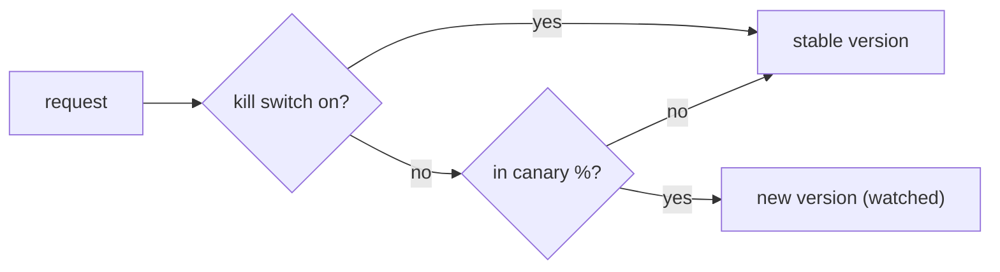

# Rollout, kill switches, and the CI gate

> **Motto** — Block the bad change before it merges, ship the good one to a few, and keep one switch that undoes it.

*Part of Phase 09 — Reliability, Evals and Ops.*

*Last reviewed: 2026-10 · Volatility: fast*

## The Problem

Evals miss things. A new prompt, tool, or model can still fail on real traffic. Two defences work together.

The first is a **CI gate**. CI is the automated check that runs on every pull request. It runs the eval harness and fails the build when the score drops, so a regression cannot merge.

The second is a **canary rollout**. You send a small share of traffic to the new version and watch the metrics. If they dip, a **kill switch** sends everyone back to the stable version at once, with no redeploy.

Both need behaviour that you can change without shipping code. That means layered config and feature flags.

## The Concept



**Layered config** has defaults in code and overrides from a file or the environment. The last layer wins.

A **percentage flag** hashes a stable id, such as a user or a repo, into a bucket from 0 to 99. The unit is on the canary when its bucket is below the percent. The same unit always gets the same answer, so users do not flicker between versions. Raising the percent only adds units.

The kill switch is checked first. During an incident, nobody needs to reason about percentages.

## Build It

`code/rollout.py` has three small parts. Config layers merge in order, and `None` means "not set here":

```python
def load_config(defaults, *layers):
    """Later layers win. A value of None means 'not set here' and does not override."""
    cfg = dict(defaults)
    for layer in layers:
        cfg.update({k: v for k, v in layer.items() if v is not None})
    return cfg
```

The bucket function includes the flag name, so two flags split users differently:

```python
def bucket(name, unit_id):
    """Map a unit (user, repo) to a stable number 0-99 for this flag."""
    return int(hashlib.sha256(f"{name}:{unit_id}".encode()).hexdigest(), 16) % 100
```

`Rollout.version_for` checks the kill switch first, then the bucket:

```python
    def version_for(self, unit_id):
        if self.killed:                     # checked first, so an incident never reasons about percent
            return self.stable
        return self.candidate if bucket(self.name, unit_id) < self.percent else self.stable
```

The asserts use 1,000 units. A 10% canary puts about 100 of them on the new version. The answer is stable per unit. Raising the percent to 50 keeps every unit that was already on the canary. After `kill()`, all 1,000 get the stable version, even at 100%.

## Use It

Wire the eval harness into CI with `outputs/evals.yml`. Copy it to `.github/workflows/evals.yml`. It runs `harness-engineering/phases/09-reliability-evals-and-ops/03-eval-harness/code/eval_harness.py` on every pull request. The script exits 1 on a regression, and that fails the job.

The workflow has a second step. It runs the harness with `--candidate regressed` and fails if the gate lets that candidate pass. So the pipeline itself proves the gate can fail.

A failing job only blocks the merge if you require it. In GitHub, add the job as a required status check in your branch protection rules. The check name must match the job name (`evals`).

Claude Code uses the same layering idea in its settings files. There are user, project, and local files, plus managed settings. When they conflict, managed settings win, then command-line flags, then local, then project, then user. Put team rules in `.claude/settings.json` so they are shared, and personal changes in `.claude/settings.local.json`.

For your own harness, key the canary by user or repo. Watch the eval score and the cost per run from [lesson 4](../../04-tracing-and-cost/docs/en.md). Keep the kill switch in a config value you can flip at once.

## Challenge

Add an auto-kill. Feed the canary's error rate into `Rollout`. If the rate on the canary units is more than twice the stable rate over 50 requests, call `kill()` by itself. Write a test with a fake stream of results.

## Sources

[Claude Code settings](https://code.claude.com/docs/en/settings)

Other track: [Launches, rollouts, and migrations](../../../../../technical-product-management/launches-rollouts-and-migrations.md) · Next: [Assemble the agent](../../../10-capstone/01-assemble-the-agent/docs/en.md)
