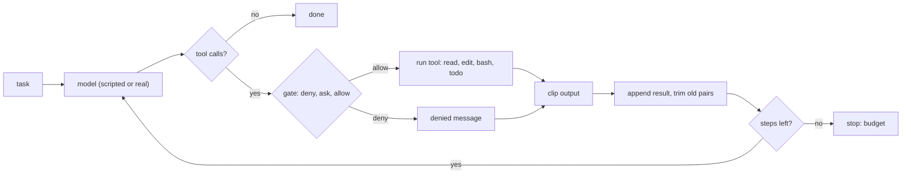

# Assemble the agent

> **Motto** — Join the parts into one agent, then prove it fixes a real bug, refuses a dangerous command, and stops at its budget.

*Part of Phase 10 — Capstone.*

*Last reviewed: 2026-10 · Volatility: fast*

## The Problem

You built the parts one at a time: a loop, tools, a permission gate, output limits, a todo list, a budget. Parts that pass their own tests can still fail together. A trim can orphan a tool result. A gate can be skipped by one code path. A loop can ignore its budget.

This lesson joins the parts in one file, `code/agent.py`. A test then drives the whole agent against a real temp repo that has a failing test. The test checks the repo, not the agent's words.

## The Concept



The model is a function: history in, content blocks out. A scripted model reads the history and picks the next call, so the test needs no API key. A real model plugs into the same slot.

Every tool call passes through the gate. Every result is clipped. Every call to the model counts as a step.

## Build It

Each part comes from an earlier lesson. Read that lesson for the why.

**The loop** ([lesson 1.3](../../../01-foundations-and-the-loop/03-the-agent-loop/docs/en.md)). The loop trims history, calls the model, runs the tools, and appends results. The step budget ends it ([lesson 1.4](../../../01-foundations-and-the-loop/04-stopping-errors-and-recovery/docs/en.md) and [lesson 9.2](../../../09-reliability-evals-and-ops/02-budgets-idempotency-degraded-mode/docs/en.md)).

```python
    def run(self, task):
        history = [{"role": "user", "content": task}]
        for step in range(1, self.max_steps + 1):
            blocks = self.model(trim_history(history, self.max_chars))
            history.append({"role": "assistant", "content": blocks})
            uses = [b for b in blocks if b["type"] == "tool_use"]
            if not uses:
                text = "".join(b.get("text", "") for b in blocks)
                return {"status": "done", "steps": step, "text": text, "history": history}
```

**Tools** ([lesson 2.1](../../../02-tools/01-schemas-registry-and-descriptions/docs/en.md), [5.2](../../../05-files-and-shell/02-edit-write-and-patch/docs/en.md), [5.4](../../../05-files-and-shell/04-bash-and-timeouts/docs/en.md)). `edit` needs exactly one match. Paths must stay inside the repo. `bash` runs one command with a timeout and no shell.

```python
    def edit(self, path, old, new):
        p = self.path(path)
        text = p.read_text()
        if text.count(old) != 1:
            return f"error: {text.count(old)} matches for old; it must match exactly once"
        p.write_text(text.replace(old, new))
        return "ok: edited"
```

**The gate** ([lesson 6.1](../../../06-permissions-and-security/01-permission-gate/docs/en.md)). Rules run in the order deny, ask, allow. Anything unmatched asks. A command that chains `rm` after an allowed test run still hits the deny rule first.

```python
def decide(name, args):
    text = args.get("cmd") or args.get("path") or ""
    for verdict in ("deny", "ask", "allow"):
        if any(v == verdict and t == name and re.search(p, text) for v, t, p in RULES):
            return verdict
    return "ask"
```

**Output limits** ([lesson 3.3](../../../03-context-and-memory/03-trim-and-compact/docs/en.md)). `clip` cuts one huge result. `trim_history` drops the oldest turns two messages at a time. A tool call and its result always leave together, so the model never sees an orphan.

```python
    head, rest, dropped = history[0], history[1:], 0
    while size([head] + rest) > limit and len(rest) > 2:
        rest, dropped = rest[2:], dropped + 1
```

**The todo list** ([lesson 7.1](../../../07-planning-and-subagents/01-todo-list/docs/en.md)). The `todo` tool replaces the whole list each time, so the plan is always one consistent state.

**The test.** `code/test_agent.py` builds a temp repo with a buggy `add()` and a failing test. It checks these things:

- The edit lands and the repo's own tests pass.
- `rm -rf .` is blocked, and the file beside it survives.
- Deny wins over allow in a chained command.
- An `ask` with no approver is refused.
- A path outside the repo is refused.
- A model that loops forever stops at the step budget, with every call answered.
- Trimming keeps pairs whole at every limit.

The tests were checked by breaking the agent on purpose. With the `rm` deny rule removed, the blocked-command test fails. With pairs split in `trim_history`, the pair test fails.

## Use It

Run `python3 code/test_agent.py` first. Then read `code/agent_sdk.py`. It replaces `scripted_model` with one function that calls the Anthropic Messages API. `agent.py` already keeps history in the tool-use message format, so the history goes straight to `messages=`. `TOOL_SPECS` goes to `tools=`. The model ID comes from `HARNESS_MODEL`. The `ask` verdict becomes a terminal prompt.

Claude Code has the same parts under other names. It evaluates permission rules in the order deny, ask, allow. It tracks tasks with `TaskCreate`, `TaskGet`, `TaskList`, and `TaskUpdate`. It bounds print-mode runs with `--max-turns`. Your 150 lines show how each part works.

Before you trust the real agent, run the evals ([lesson 9.3](../../../09-reliability-evals-and-ops/03-eval-harness/docs/en.md)) and record traces ([lesson 9.4](../../../09-reliability-evals-and-ops/04-tracing-and-cost/docs/en.md)).

## Challenge

Make the harness check the model's claim. Before `run` returns `done`, run the test command itself. If the tests fail, append the failure to the history and continue the loop. Write a scripted model that says "done" too early, and assert that the harness does not accept it.

## Sources

[Anthropic Python SDK](https://platform.claude.com/docs/en/api/sdks/python) · [Claude Code tools reference](https://code.claude.com/docs/en/tools-reference) · [Claude Code CLI reference](https://code.claude.com/docs/en/cli-reference)
