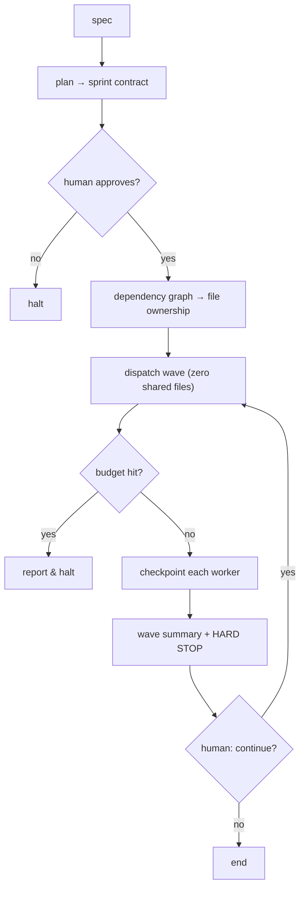

# Sprint contracts & budgeted waves

> **Motto** — Lock the contract, declare the budget, dispatch a wave, then stop and let a human decide.

*Part of Phase 10 — Subagents & Orchestration. Concept reading:
[The Ten Principles of a Working Harness](../../../../foundations/harness-principles.md)
(principles 01, 03, 04, 06, 10).*

## The Problem

Spawning one subagent is easy (previous lessons). Coordinating *several* against the
same repo is where harnesses go wrong: two workers edit the same file and silently
overwrite each other; a run loops 40 times and spends $12; an interrupted wave has to
restart from zero; nobody approved what got built. The fix isn't a smarter prompt —
it's structure: a **contract** that fixes the target and budget before dispatch, and
**waves** that hard-stop for a human between them.

## The Concept



Four invariants, straight from the principles:

1. **Spec first (01):** no worker runs until a contract is approved.
2. **Budget upfront (03):** `maxWorkers / maxCallsPerWorker / maxWaves` are declared;
   hitting any ceiling stops the run — it never auto-extends.
3. **File isolation (06):** the dependency graph assigns each worker disjoint files;
   anything with an unresolved dependency waits for the next wave.
4. **Hard stops + checkpoints (04, 10):** each wave ends with a summary and waits for
   an explicit "continue"; every worker writes a checkpoint so an interrupted run
   resumes, not restarts.

## Build It

A real orchestrator, standard library only — the agents are stubs so the *coordination*
is what you can see. `code/orchestrator.py`:

```python
from dataclasses import dataclass, field

@dataclass
class Budget:
    max_workers: int = 3
    max_calls_per_worker: int = 15
    max_waves: int = 2

@dataclass
class Task:
    name: str
    files: list          # files this task owns
    deps: list = field(default_factory=list)   # task names it depends on

@dataclass
class Contract:
    sprint_name: str
    tasks: list
    budget: Budget
    acceptance: list

def plan_waves(tasks):
    """Group tasks into waves so no wave shares a file and deps land first."""
    done, waves = set(), []
    remaining = list(tasks)
    while remaining:
        wave, used_files = [], set()
        for t in list(remaining):
            if set(t.deps) <= done and not (set(t.files) & used_files):
                wave.append(t); used_files |= set(t.files)
        if not wave:
            raise ValueError("cycle or unsplittable file conflict")
        for t in wave:
            remaining.remove(t); done.add(t.name)
        waves.append(wave)
    return waves

def run_sprint(contract, run_worker, approve, cont):
    if not approve(contract):                       # invariant 1: spec-first gate
        return "halted: contract not approved"
    waves = plan_waves(contract.tasks)
    b = contract.budget
    if len(waves) > b.max_waves:                    # invariant 2: budget ceiling
        return f"halted: {len(waves)} waves exceeds maxWaves={b.max_waves}"
    for i, wave in enumerate(waves, 1):
        if len(wave) > b.max_workers:
            return f"halted: wave {i} needs {len(wave)} workers > maxWorkers"
        checkpoints = []
        for t in wave:                              # invariant 3: disjoint files
            cp = run_worker(t, b.max_calls_per_worker)   # invariant 4: checkpoint
            checkpoints.append(cp)
        print(f"wave {i} summary: {[c['task'] for c in checkpoints]} done")
        if i < len(waves) and not cont(i):          # invariant 4: HARD STOP
            return f"stopped after wave {i} by human"
    return "sprint complete"
```

Driving it with stubs proves the structure (`__main__` in the file):

```python
tasks = [
    Task("api",   ["api/routes.py"]),
    Task("model", ["api/models.py"]),
    Task("ui",    ["web/app.tsx"], deps=["api"]),   # waits for wave 2
]
contract = Contract("health-check", tasks, Budget(), ["GET /health -> {status: ok}"])
run_sprint(contract,
           run_worker=lambda t, n: {"task": t.name, "phase": "done", "next": None},
           approve=lambda c: True,
           cont=lambda i: True)
# wave 1 summary: ['api', 'model'] done   (disjoint files, no deps)
# wave 2 summary: ['ui'] done             (ui waited for api)
# sprint complete
```

`plan_waves` is the heart: it refuses to put two tasks that touch the same file in the
same wave, and holds back tasks whose dependencies haven't landed.

## Use It

In a real harness the stubs become Claude Code subagents and git worktrees. The
contract becomes `_agent-team/sprint-contract.json`; `approve`/`cont` become the human
gates; `run_worker` spawns an agent in its own worktree and reads back its
`checkpoint.md`. The deck's `/agent-team` skill is exactly this orchestrator wired to
the planning, discovery, worker, review, and memory agents. See `outputs/` for the
contract template and the one-shot setup prompt that generates the whole pipeline.

## Ship It

This lesson ships two artifacts:

- [`outputs/sprint-contract-template.json`](../outputs/sprint-contract-template.json) —
  the contract every sprint fills in before dispatch.
- [`outputs/agent-team-setup-prompt.md`](../outputs/agent-team-setup-prompt.md) — the
  one-shot prompt that generates `CLAUDE.md`, the pipeline skill, hooks, reviewer
  prompt, and workspace.

## Check Yourself

**Q1.** Why must the reviewer agent see only the diff, not the plan?

- A) To save tokens
- B) Context leakage turns review into rationalising the author's intent
- C) The plan is secret
- D) It's faster

<details><summary>Answer</summary>B — principle 02. With the plan in hand the reviewer
defends intent instead of judging the output on its own terms.</details>

**Q2.** Two tasks both edit `api/routes.py`. The orchestrator should…

- A) run them in parallel and merge later
- B) put them in different waves so they never share a file in one wave
- C) pick one and drop the other
- D) ask the model to resolve conflicts

<details><summary>Answer</summary>B — principle 06. Shared files across parallel workers
cause silent overwrites; `plan_waves` enforces disjoint file sets per wave.</details>

**Q3.** A run hits `maxWaves`. The correct behavior is…

- A) auto-extend by one wave
- B) stop and report — never auto-extend
- C) lower the budget and retry
- D) merge whatever's done

<details><summary>Answer</summary>B — principle 03. Ceilings are hard; the human
decides whether to spend more.</details>

**Challenge.** Add a `dry_run` mode that prints the wave plan and the per-wave worker
count *without* dispatching, so a human can sanity-check file ownership against the
budget before approving the contract.

## Related

- Concept: [The Ten Principles of a Working Harness](../../../../foundations/harness-principles.md)
- Builds on: [The Agent Loop from Scratch](../../../02-the-agent-loop/01-agent-loop/docs/en.md)
- Next: adversarial review → [Phase 15 — Evals](../../../../ROADMAP.md); persistent memory → [Phase 9](../../../../ROADMAP.md)
