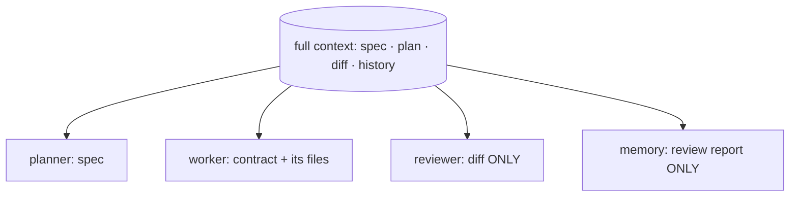

# Bounded Roles & Context Allowlists

> **Motto** — Each agent reads only its allowlist; everything else is off-limits by construction.

*Part of Phase 10 — Subagents & Orchestration. Concept:
[The Ten Principles of a Working Harness](../../../../foundations/harness-principles.md)
(principle 02).*

## The Problem

When several agents share a pipeline, the lazy move is to hand each one the whole
context — the spec, the plan, the diff, everything. It feels helpful and it quietly
breaks the pipeline. The clearest failure is review: a reviewer who can see the author's
plan starts *rationalising* it ("the author meant well") instead of judging the output
on its own terms. Context leakage turns independent review into a rubber stamp. The fix
isn't asking the agent to "be objective" — it's constructing its context so it
*cannot* see what it shouldn't.

## The Concept



Each role gets an **explicit allowlist** of context keys. The allowlist is enforced when
the prompt is *constructed* — not by trusting the agent to ignore what it was given.

## Build It

`code/roles.py` — a context store and a builder that filters by role:

```python
ROLE_ALLOWLIST = {
    "planner":  ["spec"],
    "worker":   ["contract", "files"],
    "reviewer": ["diff"],                       # never "plan" or "spec"
    "memory":   ["review_report"],
}

def build_context(role, store):
    allowed = ROLE_ALLOWLIST[role]
    leaked = [k for k in store if k not in allowed and k in ROLE_ALLOWLIST.get("_sensitive", store)]
    ctx = {k: store[k] for k in allowed if k in store}
    return ctx

def assert_no_leak(role, ctx):
    forbidden = set(ctx) - set(ROLE_ALLOWLIST[role])
    if forbidden:
        raise AssertionError(f"{role} context leaked: {forbidden}")
    return ctx
```

```python
store = {"spec": "...", "plan": "...", "diff": "- old\n+ new", "review_report": "..."}
reviewer_ctx = build_context("reviewer", store)
print(list(reviewer_ctx))                       # ['diff'] — plan/spec are absent
assert_no_leak("reviewer", reviewer_ctx)        # passes
```

The reviewer's prompt is built from `reviewer_ctx`; the plan literally isn't in scope.
`assert_no_leak` is a contract test you can run in CI so a future refactor can't widen a
role's view by accident.

## Use It

In Claude Code, role bounding is how you write subagent prompts and the `Agent` tool:
each subagent receives only the inputs its task needs, and you don't pass the parent's
full transcript. The discipline is the same — the allowlist lives in how you assemble the
subagent's prompt, enforced by construction, not by instruction.

## Ship It

[`code/roles.py`](../../02-bounded-roles/code/roles.py) — a role→allowlist context builder
with a leak assertion for CI.

## Check Yourself

**Q1.** Why must the reviewer not see the plan?

- A) to save tokens
- B) seeing intent makes it rationalise the output instead of judging it
- C) the plan is secret from users
- D) it slows review

<details><summary>Answer</summary>B — principle 02. Independent review requires judging
the diff on its own terms.</details>

**Q2.** Where is the allowlist enforced?

- A) by asking the agent nicely to ignore extra context
- B) when the agent's prompt/context is constructed
- C) in the model weights
- D) after the agent responds

<details><summary>Answer</summary>B — enforcement is structural; self-restraint is not a
control.</details>

**Challenge.** Add a `"taste"` reviewer role that sees the diff *and* a style guide but
still not the plan, and prove with `assert_no_leak` that two reviewer roles cover
complementary concerns without either seeing intent.

## Related

- Concept: [Ten principles](../../../../foundations/harness-principles.md)
- Builds on: [Sprint contracts & budgeted waves](../../01-sprint-contract-and-waves/docs/en.md)
- Next: [Worktree isolation & the dependency graph](../../03-worktree-isolation/docs/en.md)
