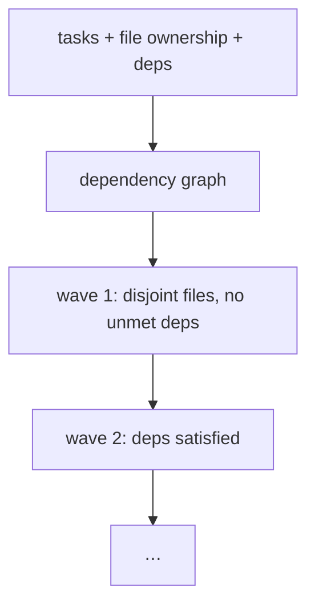

# Worktree isolation & the dependency graph

> **Motto** — Disjoint files per wave, derived from the dependency graph — no shared writes.

*Part of Phase 10 — Subagents & Orchestration. Concept:
[The Ten Principles of a Working Harness](../../../../foundations/harness-principles.md)
(principle 06).*

## The Problem

Two workers running in parallel both edit `api/routes.py`. One finishes, the other
finishes a moment later and overwrites the first — silently. No error, no conflict
marker, just lost work. This is the worst class of harness failure because nothing
*tells* you it happened. The prevention is structural: derive which files each task owns
from a dependency graph, and never put two tasks that touch the same file in the same
wave. Give each worker its own git worktree so even the filesystem is isolated.

## The Concept



Two rules turn a task list into safe waves:

1. **No shared files in a wave** — group so file ownership sets are disjoint.
2. **Dependencies land first** — a task waits until everything it depends on is done.

Each worker checks out its own `git worktree` off the feature head, so parallel edits
never touch the same working tree.

## Build It

`code/depgraph.py` — topological wave planning with file-conflict detection (the same
`plan_waves` from lesson 01, plus an explicit conflict check and worktree command
generation):

```python
def detect_conflicts(tasks):
    """Return pairs of independent tasks that share a file (would collide in parallel)."""
    bad = []
    for i, a in enumerate(tasks):
        for b in tasks[i + 1:]:
            if b.name not in a.deps and a.name not in b.deps:
                shared = set(a.files) & set(b.files)
                if shared:
                    bad.append((a.name, b.name, sorted(shared)))
    return bad

def plan_waves(tasks):
    done, waves, remaining = set(), [], list(tasks)
    while remaining:
        wave, used = [], set()
        for t in list(remaining):
            if set(t.deps) <= done and not (set(t.files) & used):
                wave.append(t); used |= set(t.files)
        if not wave:
            raise ValueError("cycle or unsplittable file conflict")
        for t in wave:
            remaining.remove(t); done.add(t.name)
        waves.append(wave)
    return waves

def worktree_cmds(task, base="feature-head"):
    branch = f"task/{task.name}"
    return [f"git worktree add -b {branch} ../wt-{task.name} {base}"]
```

`detect_conflicts` is the safety net: even if two same-file tasks lack a declared
dependency, the planner separates them across waves rather than risk a silent overwrite.

## Use It

In a real harness, `worktree_cmds` runs for real: each worker gets `../wt-<task>` as its
working directory, edits only its owned files, commits to its branch, and the orchestrator
merges branches between waves (where the review gate, Phase 15, decides ship/hold). Git
worktrees give you filesystem-level isolation for free — no containers required for the
same-repo case.

## Ship It

[`code/depgraph.py`](../../03-worktree-isolation/code/depgraph.py) — conflict detection,
wave planning, and worktree command generation.

## Check Yourself

**Q1.** Two tasks with no declared dependency both own `db/schema.sql`. The planner should…

- A) run them in parallel; git will merge
- B) place them in different waves so they never edit it simultaneously
- C) drop one
- D) error and stop the whole sprint

<details><summary>Answer</summary>B — disjoint files per wave (principle 06); the
conflict detector forces the split.</details>

**Q2.** Why give each worker its own git worktree?

- A) to use less disk
- B) filesystem-level isolation so parallel edits can't touch the same working tree
- C) to avoid writing tests
- D) it's required by the SDK

<details><summary>Answer</summary>B — isolation is the point; branches merge after the
wave.</details>

**Challenge.** Add cycle detection that names the tasks in the cycle (e.g. `a → b → a`)
instead of the generic error, so a bad contract is debuggable.

## Related

- Builds on: [Sprint contracts & budgeted waves](../../01-sprint-contract-and-waves/docs/en.md)
- Next: [Checkpoints & resumable runs](../../04-checkpoints/docs/en.md)
