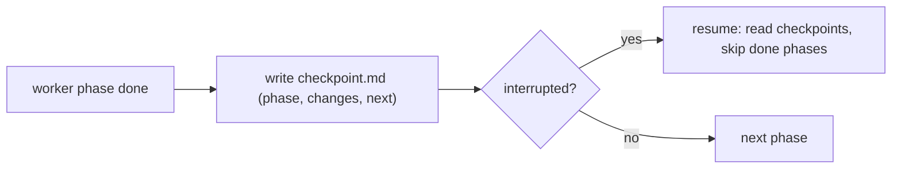

# Checkpoints & resumable runs

> **Motto** — Resume from the last checkpoint, never from zero.

*Part of Phase 10 — Subagents & Orchestration. Concept:
[The Ten Principles of a Working Harness](../../../../foundations/harness-principles.md)
(principle 10).*

## The Problem

A wave is half done — three of five workers finished — and the run is interrupted: a
crash, a timeout, a closed laptop. Without checkpoints, resuming means re-running the
*entire* wave, redoing work that already landed and possibly duplicating side effects.
This is the most expensive class of harness failure because it scales with how much you'd
already accomplished. The fix: each worker records progressive checkpoints, and the
orchestrator reads them to skip completed work on resume.

## The Concept



A checkpoint records three things: **what phase completed**, **what changed**, and
**what's next**. On resume, the orchestrator reads each task's checkpoint and dispatches
only the unfinished work.

## Build It

`code/checkpoint.py` — write/read checkpoints and a resumable runner:

```python
import json, os

def write_checkpoint(task, phase, changes, nxt, root=".checkpoints"):
    os.makedirs(root, exist_ok=True)
    path = os.path.join(root, f"{task}.json")
    data = {"task": task, "phase": phase, "changes": changes, "next": nxt}
    with open(path, "w") as f:
        json.dump(data, f)
    return path

def read_checkpoint(task, root=".checkpoints"):
    path = os.path.join(root, f"{task}.json")
    if not os.path.exists(path):
        return None
    with open(path) as f:
        return json.load(f)

def run_task(task, phases, root=".checkpoints"):
    """Run phases in order, skipping any already recorded as complete."""
    cp = read_checkpoint(task, root)
    done = cp["phase"] if cp else None
    started = done is None
    for phase, work in phases:
        if not started:
            if phase == done:                  # resume *after* the last completed phase
                started = True
            continue
        result = work()
        write_checkpoint(task, phase, result, nxt=None, root=root)
    return read_checkpoint(task, root)
```

```python
phases = [("scaffold", lambda: "files created"),
          ("implement", lambda: "logic added"),
          ("test", lambda: "tests pass")]
# First run completes scaffold+implement, then "crashes" before test:
# (simulate by writing a checkpoint at 'implement', then resuming)
write_checkpoint("api", "implement", "logic added", nxt="test")
print(run_task("api", phases)["phase"])     # -> "test"  (only the last phase ran)
```

On resume, `scaffold` and `implement` are skipped; only `test` runs. An interrupted run
costs you the *current* phase, not the whole task.

## Use It

In Claude Code, this maps to per-task workspace files (e.g. `checkpoint.md`,
`file-changes.md` under `.claude-workspace/`). A worker subagent writes its checkpoint
after each meaningful phase; the orchestrator reads it before resuming an interrupted
task. The data model you built here is exactly what those files encode.

## Ship It

[`code/checkpoint.py`](../../04-checkpoints/code/checkpoint.py) — checkpoint write/read and
a resumable task runner.

## Check Yourself

**Q1.** What three things does a useful checkpoint record?

- A) timestamp, author, model
- B) the phase completed, what changed, and what's next
- C) tokens, cost, latency
- D) just a "done" flag

<details><summary>Answer</summary>B — enough to resume intelligently and to audit the
trail.</details>

**Q2.** After resuming, the runner should…

- A) re-run every phase to be safe
- B) skip phases already recorded complete and run only the rest
- C) start a brand-new task
- D) ask the model what to do

<details><summary>Answer</summary>B — that's the entire point of checkpointing.</details>

**Challenge.** Make checkpoints atomic: write to a temp file and `os.replace` it, so an
interruption *during* the checkpoint write can't leave a corrupt half-written file.

## Related

- Builds on: [Sprint contracts & budgeted waves](../../01-sprint-contract-and-waves/docs/en.md)
- Next: [Supervisor / worker patterns](../../05-supervisor-worker/docs/en.md)
- Deepens in: Phase 9 — Memory & Persistence
