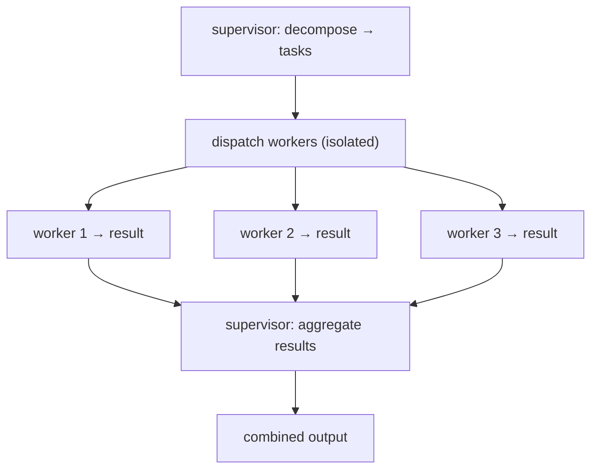

# Supervisor / Worker Patterns

> **Motto** — A supervisor decomposes and delegates; workers execute in isolation and report back.

*Part of Phase 10 — Subagents & Orchestration. Builds on lessons 01–04.*

## The Problem

A single agent doing everything in one context hits two walls: the context fills with
detail irrelevant to the current sub-task, and there's no parallelism. The
supervisor/worker pattern splits the roles — a supervisor that *plans and coordinates*
but writes no code, and workers that each own one isolated sub-task. The supervisor never
sees a worker's full transcript, only its result. This keeps each context small and lets
independent work run in parallel (within the budget from lesson 01).

## The Concept



The supervisor holds the *plan*; each worker holds only its *task*. Results flow back up
— not transcripts. This is bounded roles (lesson 02) applied to delegation.

## Build It

`code/supervisor.py` — a supervisor that decomposes, dispatches isolated workers, and
aggregates, reusing the wave planner for safety:

```python
from dataclasses import dataclass

@dataclass
class Result:
    task: str
    ok: bool
    output: str

class Supervisor:
    def __init__(self, run_worker, max_workers=3):
        self.run_worker = run_worker          # (task) -> Result, runs in isolation
        self.max_workers = max_workers

    def decompose(self, goal):
        """Toy decomposition: a real supervisor asks the model for sub-tasks."""
        return [t.strip() for t in goal.split(";") if t.strip()]

    def dispatch(self, tasks):
        results = []
        for batch_start in range(0, len(tasks), self.max_workers):
            batch = tasks[batch_start:batch_start + self.max_workers]
            results.extend(self.run_worker(t) for t in batch)   # isolated workers
        return results

    def aggregate(self, results):
        ok = [r for r in results if r.ok]
        return {"completed": [r.task for r in ok],
                "failed": [r.task for r in results if not r.ok],
                "summary": f"{len(ok)}/{len(results)} tasks succeeded"}

    def run(self, goal):
        return self.aggregate(self.dispatch(self.decompose(goal)))
```

```python
def worker(task):
    return Result(task=task, ok=("fail" not in task), output=f"did {task}")

sup = Supervisor(run_worker=worker, max_workers=2)
print(sup.run("add route; add model; fail step"))
# {'completed': ['add route', 'add model'], 'failed': ['fail step'],
#  'summary': '2/3 tasks succeeded'}
```

The supervisor only ever sees each worker's `Result`, never its internal steps —
context stays small and the failure is isolated, not contagious.

## Use It

In Claude Code this is the `Agent` tool: the parent (supervisor) spawns subagents with
scoped prompts and receives only their final message. Subagent *types* (e.g. an explore
agent, a plan agent) are specialized workers. The supervisor pattern you built is the
control structure underneath the agent-team pipeline (next lesson).

## Ship It

[`code/supervisor.py`](../../05-supervisor-worker/code/supervisor.py) — a `Supervisor` that
decomposes, dispatches isolated workers in batches, and aggregates results.

## Check Yourself

**Q1.** What does the supervisor receive back from a worker?

- A) the worker's full transcript
- B) only the worker's result
- C) nothing
- D) the worker's system prompt

<details><summary>Answer</summary>B — results flow up, not transcripts; this keeps the
supervisor's context small and bounded (lesson 02).</details>

**Q2.** Why batch worker dispatch by `max_workers`?

- A) to respect the budget ceiling and avoid unbounded parallelism
- B) to make it slower
- C) the model requires it
- D) to share files

<details><summary>Answer</summary>A — the budget from lesson 01 bounds concurrency.</details>

**Challenge.** Make `decompose` return tasks *with file ownership and deps*, then feed
them through `plan_waves` (lesson 03) so the supervisor dispatches conflict-free waves
instead of fixed-size batches.

## Related

- Builds on: [Bounded roles](../../02-bounded-roles/docs/en.md), [Worktree isolation](../../03-worktree-isolation/docs/en.md)
- Next: [Use It: the agent-team pipeline](../../06-agent-team-pipeline/docs/en.md)
