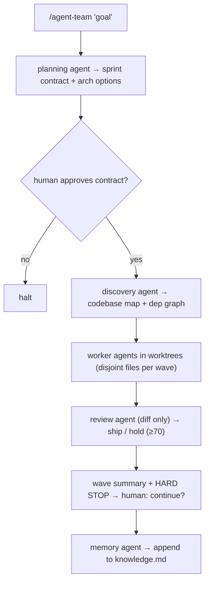

# Use It: The Agent-Team Pipeline

> **Motto** — Wire the contract, roles, dependency graph, checkpoints, and review into one skill.

*Part of Phase 10 — Subagents & Orchestration. Builds on lessons 01–05; completes the phase.*

## The Problem

You've built every piece separately: the budgeted-wave orchestrator (01), bounded roles
(02), worktree isolation and the dependency graph (03), checkpoints (04), and the
supervisor pattern (05). On their own they're modules. Assembled, they're a **pipeline**:
a repeatable, auditable process that takes a goal and produces reviewed, merged code with
a memory of what was learned. This lesson wires them into a single Claude Code skill so a
human runs `/agent-team "build X"` and gets the whole disciplined flow.

## The Concept



Five agents, each with a bounded role; budgets and hard stops from lesson 01; file
isolation from lesson 03; checkpoints from lesson 04. The skill is the glue.

## Build It (the skill definition)

The pipeline is encoded as `outputs/SKILL.md` — a Claude Code skill that orchestrates
five subagents. It declares each agent's inputs/outputs (legibility: the pipeline is
discoverable from the repo), the budget defaults, and the wave discipline. The Python
modules from lessons 01–05 are the reference implementation of its control logic; the
skill expresses the same logic for a real agent runtime.

Key wiring decisions, each tracing to an earlier lesson:

| Pipeline step | Backed by |
| --- | --- |
| Sprint contract + approval gate | Lesson 01 (`Contract`, `approve`) |
| Each agent sees only its inputs | Lesson 02 (`ROLE_ALLOWLIST`) |
| Workers get disjoint files in worktrees | Lesson 03 (`plan_waves`, `worktree_cmds`) |
| Resumable interrupted waves | Lesson 04 (`checkpoint`) |
| Decompose → dispatch → aggregate | Lesson 05 (`Supervisor`) |
| Diff-only review, score ≥ 70 | Phase 15 (Evals) |
| Append-only learnings | Phase 9 (Memory), `knowledge.md` |

## Use It

Install the skill and run it:

```bash
cp outputs/SKILL.md .claude/skills/agent-team/SKILL.md
# in Claude Code:
/agent-team "add a health-check route returning {status: ok}"
```

The planning agent emits a contract; you approve it; workers run in isolated worktrees;
the reviewer returns ship/hold; the wave halts for your "continue"; the memory agent
records what was learned. Every principle from the
[ten principles](../../../../foundations/harness-principles.md) is now mechanical.

## Ship It

[`outputs/SKILL.md`](../../06-agent-team-pipeline/outputs/SKILL.md) — the installable
agent-team pipeline skill.

## Check Yourself

**Q1.** Why encode the pipeline as a skill in the repo rather than a Slack/Notion doc?

- A) it looks nicer
- B) legibility — the pipeline is discoverable and auditable from the repo itself
- C) to save tokens
- D) skills run faster

<details><summary>Answer</summary>B — the repo explains itself; an agent (or human) finds
the process without external context.</details>

**Q2.** The review agent in the pipeline receives…

- A) the contract, plan, and diff
- B) the diff only
- C) the full worker transcripts
- D) the memory file

<details><summary>Answer</summary>B — bounded roles (lesson 02); independent review needs
the diff alone.</details>

**Challenge.** Extend the skill with a `dry-run` that prints the wave plan, per-wave
worker count, and file ownership *before* dispatch, so a human can sanity-check the
contract against the budget.

## Related

- Concept: [The ten principles of a working harness](../../../../foundations/harness-principles.md)
- Builds on: lessons [01](../../01-sprint-contract-and-waves/docs/en.md)–[05](../../05-supervisor-worker/docs/en.md)
- Next phases: Phase 15 — Evals (the review agent), Phase 9 — Memory (`knowledge.md`)
