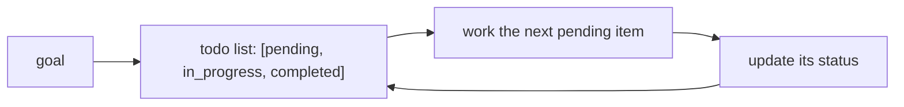

# A Todo/Task Data Model

> **Motto** — A long task is a list of small ones with status — give the agent that list.

*Part of Phase 11 — Planning & Task Management.*

## The Problem

On a multi-step task, an agent without an explicit task list drifts: it forgets a step,
repeats one, or declares victory early. A structured **todo model** — items with a status
and order — gives the agent (and you) a shared, visible plan it works through and updates,
so progress is legible and nothing is silently dropped.

## The Concept



Exactly one item `in_progress` at a time keeps focus; statuses make "what's left" obvious.

## Build It

`code/todo.py` — a minimal task list with a single-in-progress invariant:

```python
from dataclasses import dataclass, field

@dataclass
class Task:
    id: int
    text: str
    status: str = "pending"        # pending | in_progress | completed

@dataclass
class TodoList:
    tasks: list = field(default_factory=list)

    def add(self, text):
        self.tasks.append(Task(len(self.tasks) + 1, text))

    def start(self, tid):
        for t in self.tasks:
            if t.status == "in_progress":
                raise ValueError("finish the in-progress task first")
        self._get(tid).status = "in_progress"

    def complete(self, tid):
        self._get(tid).status = "completed"

    def next_pending(self):
        return next((t for t in self.tasks if t.status == "pending"), None)

    def _get(self, tid):
        return next(t for t in self.tasks if t.id == tid)

    def render(self):
        mark = {"pending": "[ ]", "in_progress": "[~]", "completed": "[x]"}
        return "\n".join(f"{mark[t.status]} {t.text}" for t in self.tasks)
```

```python
todo = TodoList()
for s in ["read code", "write fix", "run tests"]:
    todo.add(s)
todo.start(1); todo.complete(1); todo.start(2)
print(todo.render())
```

The single-in-progress rule is what keeps a long run from fragmenting into half-done
threads.

## Use It

This is Claude Code's **todo list** (the checklist you see it maintain) and Codex's plan:
the agent writes the plan, marks one item in progress, completes it, moves on — and you can
watch it. As a user, asking the agent to "make a plan first" on a big task triggers exactly
this, and gives you a checkpoint to correct course before it builds the wrong thing.

## Ship It

[`code/todo.py`](../../01-todo-model/code/todo.py) — a todo list with a single-in-progress
invariant.

## Check Yourself

**Q1.** Why allow only one task in progress at a time?

- A) it's simpler to code
- B) it keeps focus and prevents fragmenting into half-done threads
- C) the API requires it
- D) no reason

<details><summary>Answer</summary>B — one in-progress item keeps the run coherent.</details>

**Q2.** What does an explicit todo list give the *user*?

- A) nothing
- B) a legible plan and a checkpoint to correct course before work is done wrong
- C) faster output
- D) lower cost

<details><summary>Answer</summary>B — visibility and a steering point.</details>

**Challenge.** Add task dependencies (a task can't start until its deps are completed) and a
`next_actionable()` that respects them — echoing the wave planner from Phase 10.

## Related

- Builds on: Phase 9 — [Scratchpad](../../../09-memory-and-persistence/01-scratchpad/docs/en.md)
- Next: [Plan mode: propose before you act](../../02-plan-mode/docs/en.md)
- [Roadmap](../../../../ROADMAP.md)
