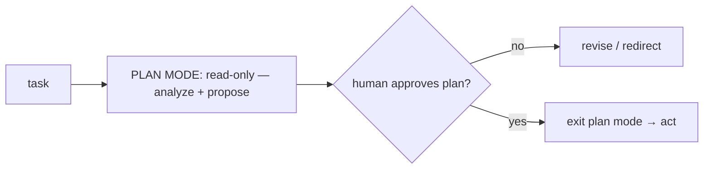

# Plan mode: propose before you act

> **Motto** — For risky or ambiguous work, the agent proposes a plan and waits — read-only until you say go.

*Part of Phase 11 — Planning & Task Management.*

## The Problem

Letting an agent start editing immediately on a big or fuzzy task is how you get the wrong
thing built fast. **Plan mode** inverts that: the agent may *read and analyze* but **not
mutate** anything; it produces a plan; you approve (or redirect); only then does it act.
It's the spec-first principle (Phase 10) at the single-agent level.

## The Concept



The enforcement is a permission mode (Phase 8): in plan mode, mutating tools
(write/edit/bash) are denied; reads are allowed.

## Build It

`code/plan_mode.py` — a read-only gate that blocks mutations until approved:

```python
MUTATING = {"write", "edit", "bash"}

class PlanMode:
    def __init__(self):
        self.active = True
        self.plan = None

    def propose(self, plan):
        self.plan = plan
        return "plan ready for approval:\n" + plan

    def approve(self):
        self.active = False
        return "approved — exiting plan mode"

    def gate(self, tool):
        if self.active and tool in MUTATING:
            return f"blocked: '{tool}' not allowed in plan mode (read-only until approved)"
        return "allowed"
```

```python
pm = PlanMode()
print(pm.gate("read"))        # allowed
print(pm.gate("write"))       # blocked (plan mode)
pm.propose("1) edit api.py 2) add test")
pm.approve()
print(pm.gate("write"))       # allowed (after approval)
```

The gate makes plan mode real: the agent literally cannot mutate the repo until you approve
the plan — not by promise, by permission.

## Use It

This is Claude Code's **plan mode** (shift-tab / `--permission-mode plan`): the agent
researches and presents a plan, and edits are blocked until you accept it. Codex has an
equivalent propose-then-apply flow. Use it for anything non-trivial — it's the cheapest way
to catch a wrong approach before any code is written.

## Ship It

[`code/plan_mode.py`](../../02-plan-mode/code/plan_mode.py) — a read-only plan-mode gate.

## Check Yourself

**Q1.** What can the agent do in plan mode?

- A) anything
- B) read and analyze, but not mutate (write/edit/bash) until approved
- C) nothing
- D) only write

<details><summary>Answer</summary>B — read-only until the plan is accepted.</details>

**Q2.** Plan mode is enforced by…

- A) a polite prompt
- B) a permission mode that denies mutating tools (Phase 8)
- C) the model's goodwill
- D) a timeout

<details><summary>Answer</summary>B — it's permission enforcement, not persuasion.</details>

**Challenge.** Wire `PlanMode` into the Phase 8 `PermissionGate` as a mode that returns
`deny` for mutating tools, so plan mode is just a permission configuration.

## Related

- Builds on: [Todo model](../../01-todo-model/docs/en.md); Phase 8 — [Permission modes](../../../08-permissions-and-safety-gating/01-permission-modes/docs/en.md)
- Next: [Task decomposition prompts](../../03-decomposition/docs/en.md)
- Related: Phase 10 — spec-first
- [Roadmap](../../../../ROADMAP.md)
