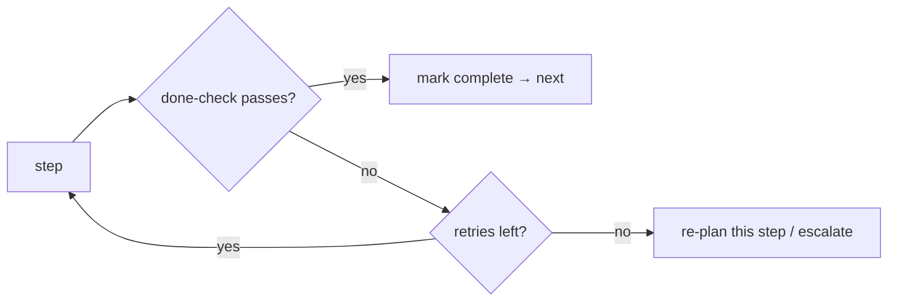

# Progress tracking & self-correction

> **Motto** — Watch the plan execute; when a step stalls or fails, re-plan instead of grinding.

*Part of Phase 11 — Planning & Task Management.*

## The Problem

A plan is only useful if the agent *tracks* its execution and reacts. Two failure modes:
the agent marks a step done that didn't actually pass its check (false progress), or it
retries the same failing step forever (no self-correction). The harness needs to verify each
step's done-check and, on repeated failure, trigger a re-plan rather than spin.

## The Concept



Progress is measured by *verification*, not by the agent's say-so; stalls trigger re-planning.

## Build It

`code/progress.py` — track step outcomes and decide continue / re-plan:

```python
class Progress:
    def __init__(self, max_retries=2):
        self.max_retries = max_retries
        self.attempts = {}

    def run_step(self, step, do, verify):
        n = self.attempts.get(step, 0)
        while n <= self.max_retries:
            do(step)
            if verify(step):
                return {"step": step, "status": "complete", "attempts": n + 1}
            n += 1
            self.attempts[step] = n
        return {"step": step, "status": "needs_replan", "attempts": n}
```

```python
calls = {"build": 0}
def do(s): calls[s] += 1
def verify(s): return calls[s] >= 3          # passes on the 3rd attempt
p = Progress(max_retries=3)
print(p.run_step("build", do, verify))       # complete after retries

calls2 = {"flaky": 0}
print(Progress(max_retries=1).run_step("flaky", lambda s: None, lambda s: False))
# needs_replan — stop grinding, escalate/re-plan
```

`verify` is the gate: a step is only "complete" when its check passes; persistent failure
returns `needs_replan` so the agent (or human) changes approach instead of looping.

## Use It

In Claude Code / Codex this is the agent updating its todo list as it verifies each step
(running the test before checking the box) and re-planning when stuck. As a user, insist on
verification ("run the tests after each step") so progress is real — tying back to "report
outcomes faithfully; if tests fail, say so."

## Ship It

[`code/progress.py`](../../04-progress-tracking/code/progress.py) — a verify-driven progress
tracker with re-plan escalation.

## Check Yourself

**Q1.** When is a step actually "complete"?

- A) when the agent says so
- B) when its done-check (test/command) passes
- C) after one attempt
- D) never

<details><summary>Answer</summary>B — verification, not the agent's claim.</details>

**Q2.** A step fails repeatedly. The right move is…

- A) retry forever
- B) stop after the retry budget and re-plan / escalate
- C) mark it done
- D) skip silently

<details><summary>Answer</summary>B — bounded retries, then re-plan.</details>

**Challenge.** Combine with the todo model (lesson 01): drive a whole `TodoList` with
`Progress`, marking tasks complete only on verify and surfacing any `needs_replan`.

## Related

- Builds on: [Todo model](../../01-todo-model/docs/en.md), [Decomposition](../../03-decomposition/docs/en.md)
- Next: [Use It: plan mode in a real harness](../../05-plan-mode-in-practice/docs/en.md)
- Related: Phase 14 — Reliability (budgets), Phase 15 — Evals
- [Roadmap](../../../../ROADMAP.md)
