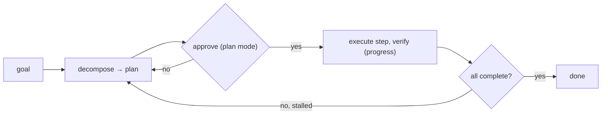

# Use It: Plan Mode in a Real Harness

> **Motto** — Wire decomposition, plan mode, the todo list, and progress tracking into one workflow.

*Part of Phase 11 — Planning & Task Management. Completes the phase.*

## The Problem

You've built the pieces — task model (01), plan-mode gate (02), decomposition prompt (03),
progress tracker (04). The payoff is a single workflow a Claude Code / Codex user runs on any
non-trivial task: **decompose → review in plan mode → execute with verification → re-plan on
stall**. This lesson packages that as a skill.

## The Concept

## Build It / Use It

The artifact is `outputs/SKILL.md` — a `/plan-and-build` skill that runs the loop using this
phase's discipline: produce a decomposed plan, stop in plan mode for approval, then execute
each step and only check it off when its verification passes, re-planning if a step stalls.

## Use It

Install the skill and run `/plan-and-build "<goal>"` in Claude Code / Codex. It enforces the
habits this phase teaches: plan before acting, keep a visible todo list, verify each step,
and re-plan instead of grinding. For most users this is the single highest-leverage workflow
— it's what turns "the agent went off and did something" into "the agent and I agreed on a
plan, and I watched it land."

## Ship It

[`outputs/SKILL.md`](../../05-plan-mode-in-practice/outputs/SKILL.md) — a `/plan-and-build`
skill composing the phase.

## Check Yourself

**Q1.** The plan-and-build loop's order is…

- A) act, then plan
- B) decompose → approve (plan mode) → execute with verification → re-plan on stall
- C) execute → verify → decompose
- D) random

Answer
B — plan first, verify throughout, re-plan when
stuck.

**Q2.** Why is this the highest-leverage workflow for a coding-agent user?

- A) it's fastest
- B) it gives a checkpoint before work and verified progress during it
- C) it uses fewer tokens
- D) no reason

Answer
B — alignment up front + real progress.

**Challenge.** Extend the skill so that, for a large goal, it offers to dispatch independent
steps in parallel (Phase 10 waves) instead of sequentially.

## Related

- Builds on: the whole phase
- Scales to: Phase 10 — Orchestration
- Phase complete → next: Phase 12 — [MCP & Extensibility](../../../../ROADMAP.md)
- [Roadmap](../../../../ROADMAP.md)
