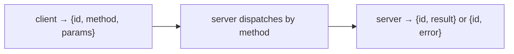

# The MCP wire protocol from scratch

> **Motto** — MCP is JSON-RPC: a request with a method and params, a response with a result.

*Part of Phase 12 — MCP & Extensibility.*

## The Problem

MCP (the Model Context Protocol) is how Claude Code / Codex connect to external tool
servers. Before using an SDK, understand the wire: it's **JSON-RPC 2.0** — each message is a
small JSON object with an `id`, a `method`, and `params`; the reply echoes the `id` with a
`result` or `error`. Once you've framed and dispatched a few messages by hand, the SDK is
just ergonomics.

## The Concept



Core methods: `initialize` (handshake), `tools/list` (discover), `tools/call` (invoke).

## Build It

`code/protocol.py` — JSON-RPC framing + a method dispatcher, in-memory:

```python
import json

def request(id, method, params=None):
    return json.dumps({"jsonrpc": "2.0", "id": id, "method": method, "params": params or {}})

def response(id, result=None, error=None):
    msg = {"jsonrpc": "2.0", "id": id}
    msg["error" if error else "result"] = error or result
    return json.dumps(msg)

class Dispatcher:
    def __init__(self):
        self.methods = {}

    def method(self, name):
        def deco(fn): self.methods[name] = fn; return fn
        return deco

    def handle(self, raw):
        msg = json.loads(raw)
        fn = self.methods.get(msg["method"])
        if not fn:
            return response(msg["id"], error={"code": -32601, "message": "method not found"})
        try:
            return response(msg["id"], result=fn(msg.get("params", {})))
        except Exception as e:
            return response(msg["id"], error={"code": -32603, "message": str(e)})
```

```python
d = Dispatcher()
d.method("ping")(lambda p: "pong")
print(d.handle(request(1, "ping")))          # {"jsonrpc":"2.0","id":1,"result":"pong"}
print(d.handle(request(2, "nope")))          # error -32601
```

That's the whole protocol core: frame a request, dispatch by method name, frame a result or
a structured error (with JSON-RPC error codes).

## Use It

Real MCP runs this JSON-RPC over a transport — **stdio** (a subprocess) or **HTTP/SSE**.
Claude Code / Codex speak exactly this to every MCP server you add. You'll use the SDK
(lesson 06) so you never hand-write framing, but when a server misbehaves, you can read the
JSON-RPC traffic and know what `tools/call` should look like.

## Ship It

[`code/protocol.py`](../../01-wire-protocol/code/protocol.py) — JSON-RPC framing + a method
dispatcher.

## Check Yourself

**Q1.** MCP is built on…

- A) REST
- B) JSON-RPC 2.0 (id + method + params → result/error)
- C) GraphQL
- D) gRPC only

<details><summary>Answer</summary>B — JSON-RPC messages over a transport.</details>

**Q2.** The three core methods to get tools working are…

- A) get, post, put
- B) `initialize`, `tools/list`, `tools/call`
- C) login, list, logout
- D) open, read, close

<details><summary>Answer</summary>B — handshake, discover, invoke.</details>

**Challenge.** Add `initialize` returning server capabilities and a protocol version, and
reject `tools/call` before `initialize` has run.

## Related

- Builds on: Phase 3 — [Tool registry](../../../03-tool-engineering/08-tool-registry/docs/en.md)
- Next: [An MCP server](../../02-mcp-server/docs/en.md)
- [Roadmap](../../../../ROADMAP.md)
