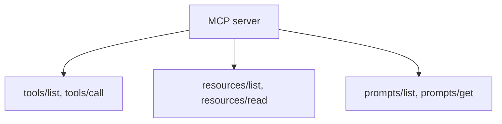

# An MCP Server: Tools, Resources, Prompts

> **Motto** — An MCP server exposes three things: tools to call, resources to read, prompts to reuse.

*Part of Phase 12 — MCP & Extensibility.*

## The Problem

With the wire protocol in hand (lesson 01), build a real **server**. MCP servers expose
three capability types: **tools** (functions the agent calls), **resources** (data the agent
reads, like files or records), and **prompts** (reusable prompt templates). Implement the
`tools/list` + `tools/call` (and resource) methods over the dispatcher and you have a server
any MCP client can use.

## The Concept



## Build It

`code/server.py` — an MCP server (tools + resources) on the Phase 12 dispatcher:

```python
from protocol import Dispatcher, request   # lesson 01

class MCPServer:
    def __init__(self):
        self.d = Dispatcher()
        self.tools = {}          # name -> (schema, fn)
        self.resources = {}      # uri -> content
        self.d.method("tools/list")(lambda p: [s for s, _ in self.tools.values()])
        self.d.method("tools/call")(self._call)
        self.d.method("resources/read")(lambda p: self.resources.get(p["uri"], ""))

    def add_tool(self, name, schema, fn):
        self.tools[name] = ({**schema, "name": name}, fn)

    def add_resource(self, uri, content):
        self.resources[uri] = content

    def _call(self, params):
        name = params["name"]
        if name not in self.tools:
            raise ValueError(f"unknown tool {name}")
        return str(self.tools[name][1](**params.get("arguments", {})))

    def handle(self, raw):
        return self.d.handle(raw)
```

```python
srv = MCPServer()
srv.add_tool("add", {"description": "Add.", "input_schema": {}}, lambda a, b: a + b)
srv.add_resource("file://readme", "hello")
print(srv.handle(request(1, "tools/list")))
print(srv.handle(request(2, "tools/call", {"name": "add", "arguments": {"a": 2, "b": 3}})))
print(srv.handle(request(3, "resources/read", {"uri": "file://readme"})))
```

The server is just the dispatcher plus registries for tools and resources — `tools/list`
returns schemas, `tools/call` runs the function, `resources/read` returns content.

## Use It

This is what a real MCP server does (the memory server from Phase 9 is one). You add such
servers to Claude Code via `.mcp.json` / `claude mcp add` and to Codex via its MCP config;
the agent then sees the server's tools alongside its built-ins. Popular servers expose
GitHub, databases, browsers, and docs this way.

## Ship It

[`code/server.py`](../../02-mcp-server/code/server.py) — an MCP server with tools + resources.

## Check Yourself

**Q1.** The three capability types an MCP server exposes are…

- A) read, write, delete
- B) tools, resources, prompts
- C) GET, POST, PUT
- D) input, output, error

<details><summary>Answer</summary>B — tools (call), resources (read), prompts
(reuse).</details>

**Q2.** `tools/list` returns…

- A) the tool implementations
- B) the tool schemas the client shows the model
- C) resources
- D) nothing

<details><summary>Answer</summary>B — schemas for discovery.</details>

**Challenge.** Add `prompts/list` and `prompts/get` so the server can ship reusable prompt
templates (like the artifacts this course produces).

## Related

- Builds on: [Wire protocol](../../01-wire-protocol/docs/en.md); Phase 9 — [memory server](../../../09-memory-and-persistence/05-memory-mcp/docs/en.md)
- Next: [An MCP client & tool discovery](../../03-mcp-client/docs/en.md)
- [Roadmap](../../../../ROADMAP.md)
