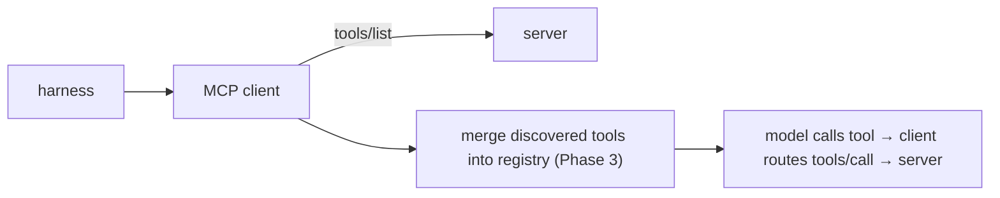

# An MCP client & tool discovery

> **Motto** — The client connects, discovers the server's tools, and exposes them to the model.

*Part of Phase 12 — MCP & Extensibility.*

## The Problem

A server is useless without a **client**. The harness side of MCP connects to a server,
calls `initialize`, fetches `tools/list`, and merges those tools into the agent's tool set
so the model can call them — routing each `tool_use` for a server tool back over `tools/call`.
This is how external tools become indistinguishable from built-ins to the model.

## The Concept



## Build It

`code/client.py` — a client that discovers and invokes server tools (talks to the lesson-02
server in-process):

```python
import json

class MCPClient:
    def __init__(self, server):
        self.server = server          # anything with .handle(raw_json) -> raw_json
        self._id = 0

    def _rpc(self, method, params=None):
        self._id += 1
        raw = json.dumps({"jsonrpc": "2.0", "id": self._id,
                          "method": method, "params": params or {}})
        return json.loads(self.server.handle(raw))

    def list_tools(self):
        return self._rpc("tools/list").get("result", [])

    def call(self, name, **arguments):
        r = self._rpc("tools/call", {"name": name, "arguments": arguments})
        return r.get("result", r.get("error"))
```

```python
# server is an MCPServer from lesson 02 with an "add" tool
tools = client.list_tools()                 # [{'name': 'add', ...}]
print(client.call("add", a=2, b=3))         # 5
```

`list_tools()` feeds the model's `tools=` (merged via the Phase 3 registry); `call()` is what
the loop runs when the model invokes a server tool. The model never knows the tool lives in
another process.

## Use It

This client logic is built into Claude Code / Codex: you declare servers in config, the tool
connects and discovers their tools at startup, and they appear (often namespaced, like
`mcp__github__*`) in the agent's toolset. When a server's tools don't show up, it's almost
always a failed `initialize`/`tools/list` — exactly the calls you implemented.

## Ship It

[`code/client.py`](../../03-mcp-client/code/client.py) — an MCP client with tool discovery and
invocation.

## Check Yourself

**Q1.** After connecting, the client calls ____ to learn what the server offers.

- A) `ping`
- B) `tools/list`
- C) `resources/read`
- D) `shutdown`

<details><summary>Answer</summary>B — discovery via `tools/list`.</details>

**Q2.** To the model, an MCP server's tool looks like…

- A) a special remote call it must handle differently
- B) just another tool in its tool set (the client routes it)
- C) a resource
- D) a prompt

<details><summary>Answer</summary>B — discovered tools merge with built-ins.</details>

**Challenge.** Merge discovered tools into the Phase 3 `Registry` with a namespace prefix
(e.g. `mcp__demo__add`) so server and local tools share one dispatch path.

## Related

- Builds on: [MCP server](../../02-mcp-server/docs/en.md); Phase 3 — [Registry](../../../03-tool-engineering/08-tool-registry/docs/en.md)
- Next: [Skills (SKILL.md) & progressive disclosure](../../04-skills/docs/en.md)
- [Roadmap](../../../../ROADMAP.md)
