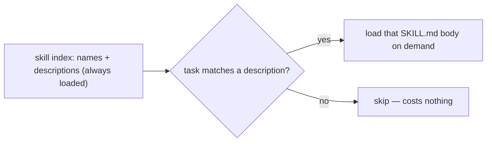

# Skills (SKILL.md) & Progressive Disclosure

> **Motto** — A skill is a named capability the agent loads only when it's relevant.

*Part of Phase 12 — MCP & Extensibility.*

## The Problem

You can't put every workflow, rubric, and procedure into the system prompt — it would be
enormous and mostly irrelevant on any given task. **Skills** solve this with progressive
disclosure: each skill is a small `SKILL.md` with a name + description the agent always sees,
but whose full body is loaded only when the description matches the task. The agent gets a
big library of capabilities at near-zero standing context cost.

## The Concept

This is the legibility principle as a mechanism: read the index, follow one link, load only
what you need.

## Build It (the format)

The artifact is the skill format itself. `outputs/SKILL.md` is a template: YAML frontmatter
(`name`, `description` with trigger phrases) + a procedure body. The whole course ships
skills in this exact shape (`/find-your-level`, `/check-understanding`, `/agent-team`,
`/plan-and-build`). The rule for a good description: list the *trigger phrases* so matching is
reliable; keep the body focused on one capability.

## Use It

This is Claude Code / Codex **skills**: drop a `SKILL.md` under `.claude/skills/<name>/`, and
the agent surfaces it when relevant and loads its body on demand. Progressive disclosure is
why you can install dozens of skills without bloating context — only the matching one's body
enters the window. Every `outputs/SKILL.md` in this course is installable this way.

## Ship It

[`outputs/SKILL.md`](../../04-skills/outputs/SKILL.md) — a SKILL.md template demonstrating the
format + progressive disclosure.

## Check Yourself

**Q1.** What is always loaded vs. loaded on demand for a skill?

- A) the whole body is always loaded
- B) the name + description are always loaded; the body loads only when relevant
- C) nothing is loaded
- D) only the body

Answer
B — progressive disclosure: index always, body on
demand.

**Q2.** What makes a skill's description reliable at triggering?

- A) being vague
- B) listing concrete trigger phrases for when to use it
- C) being long
- D) no description

Answer
B — explicit triggers drive matching.

**Challenge.** Write a skill for a workflow you repeat (e.g. "open a PR") with a tight
description and a 5-step body, and install it under `.claude/skills/`.

## Related

- Builds on: Phase 5 — [Memory files](../../../05-prompt-instruction-architecture/02-memory-files/docs/en.md)
- Next: [Plugins & deferred tool loading](../../05-plugins/docs/en.md)
- [Roadmap](../../../../ROADMAP.md)
