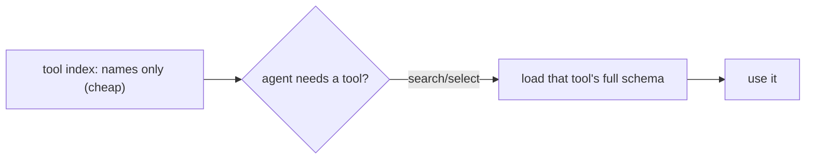

# Plugins & deferred tool loading

> **Motto** — Load a tool's full definition only when it's about to be used — names up front, schemas on demand.

*Part of Phase 12 — MCP & Extensibility.*

## The Problem

With many MCP servers and plugins connected, the agent could face *hundreds* of tool
schemas — bloating the context and slowing tool selection. **Deferred loading** fixes this:
keep a lightweight index of tool *names*, and fetch a tool's full schema only when it's
selected or searched for. It's progressive disclosure (lesson 04) applied to tools.

## The Concept



## Build It

`code/deferred.py` — a registry that defers schema loading:

```python
class DeferredRegistry:
    def __init__(self):
        self._loaders = {}        # name -> () -> full schema
        self._cache = {}

    def register(self, name, loader):
        self._loaders[name] = loader      # cheap: just the name + a thunk

    def index(self):
        return list(self._loaders)        # names only — what's always in context

    def load(self, name):
        if name not in self._cache:
            self._cache[name] = self._loaders[name]()   # fetch full schema on demand
        return self._cache[name]

    def search(self, term):
        return [n for n in self._loaders if term in n]
```

```python
reg = DeferredRegistry()
reg.register("github_create_pr", lambda: {"name": "github_create_pr", "input_schema": {"...": "big"}})
reg.register("github_list_issues", lambda: {"name": "github_list_issues", "input_schema": {}})
print(reg.index())                    # ['github_create_pr', 'github_list_issues'] (cheap)
print(reg.search("pr"))               # ['github_create_pr']
print(reg.load("github_create_pr"))   # full schema fetched only now
```

Only names sit in context; a heavy schema is materialized just-in-time when the agent
searches for or selects the tool.

## Use It

This is exactly the **deferred tool / tool-search** pattern you've seen: large tool sets
(many MCP servers, plugin bundles) are presented as names, and the agent fetches a tool's
full schema via a search step before calling it. Claude Code plugins and big MCP fleets rely
on this so connecting many servers doesn't drown the context window.

## Ship It

[`code/deferred.py`](../../05-plugins/code/deferred.py) — a deferred-loading tool registry.

## Check Yourself

**Q1.** What stays in context with deferred loading?

- A) every tool's full schema
- B) just tool names (the index); full schemas load on demand
- C) nothing
- D) only resources

<details><summary>Answer</summary>B — names always, schemas just-in-time.</details>

**Q2.** Why does this matter with many MCP servers?

- A) it doesn't
- B) hundreds of full schemas would bloat context and slow selection
- C) servers require it
- D) to save disk

<details><summary>Answer</summary>B — deferral keeps the window lean at scale.</details>

**Challenge.** Add an LRU cap to the schema cache so even loaded schemas are evicted when not
recently used.

## Related

- Builds on: [Skills](../../04-skills/docs/en.md), [MCP client](../../03-mcp-client/docs/en.md)
- Next: [Use It: the official MCP SDK](../../06-official-sdk/docs/en.md)
- [Roadmap](../../../../ROADMAP.md)
