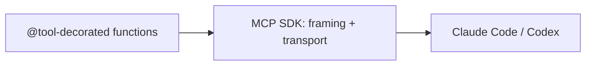

# Use It: The Official MCP SDK

> **Motto** — You built the protocol; now let the SDK handle the framing and transport.

*Part of Phase 12 — MCP & Extensibility. Completes the phase.*

## The Problem

Your from-scratch server and client (lessons 01–03) taught you the protocol, but you don't
ship hand-rolled JSON-RPC framing and stdio plumbing in production — you use the official
**MCP SDK** (`mcp` for Python, `@modelcontextprotocol/sdk` for TypeScript). It handles the
handshake, transports (stdio/HTTP), schemas, and errors. Because you built the toy version,
the SDK is transparent.

## The Concept



You declare tools; the SDK exposes them over a real transport to any MCP client.

## Build It / Use It

`code/sdk_server.py` shows the Python SDK shape (install `mcp` to run). It's the same memory
server from Phase 9, now a real MCP server:

```python
from mcp.server.fastmcp import FastMCP

mcp = FastMCP("memory")

@mcp.tool()
def remember(fact: str) -> str:
    """Save a durable fact."""
    _STORE.append(fact)
    return "remembered"

@mcp.tool()
def recall(query: str, k: int = 3) -> list[str]:
    """Retrieve relevant facts."""
    return [f for f in _STORE if any(w in f for w in query.split())][:k]

_STORE: list[str] = []

if __name__ == "__main__":
    mcp.run()                    # serves over stdio by default
```

The `@mcp.tool()` decorator does what your lesson-02 `add_tool` did — derives the schema from
the type hints and registers the handler — and `mcp.run()` is your dispatcher + transport.
Compare it to `server.py` to see exactly what the SDK abstracts.

## Use It

Register it with Claude Code (`claude mcp add memory -- python sdk_server.py`) or in Codex's
MCP config, and the agent gains `remember`/`recall` tools across sessions. This is the
end-state of the phase: a real, installable MCP server whose internals you fully understand
because you built the protocol by hand first.

## Ship It

[`code/sdk_server.py`](../../06-official-sdk/code/sdk_server.py) — a memory MCP server on the
official Python SDK.

## Check Yourself

**Q1.** What does the SDK's `@mcp.tool()` decorator save you from writing?

- A) the business logic
- B) JSON-RPC framing, schema derivation, and transport plumbing
- C) the tool's name
- D) nothing

<details><summary>Answer</summary>B — the protocol mechanics you built in lessons
01–03.</details>

**Q2.** How do you add this server to a coding agent?

- A) paste it into the prompt
- B) register it in the agent's MCP config (e.g. `claude mcp add ...`)
- C) you can't
- D) commit it to git only

<details><summary>Answer</summary>B — declare it as an MCP server in config.</details>

**Challenge.** Port `sdk_server.py` to the TypeScript SDK (`@modelcontextprotocol/sdk`) and
register it with both Claude Code and Codex.

## Related

- Builds on: the whole phase; Phase 9 — [memory server](../../../09-memory-and-persistence/05-memory-mcp/docs/en.md)
- Phase complete → next: Phase 13 — [Retrieval & Codebase Understanding](../../../../ROADMAP.md)
- [Roadmap](../../../../ROADMAP.md)
