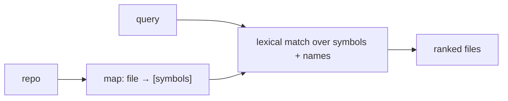

# Lexical Search & Repo Maps

> **Motto** — Give the agent a map of the repo's symbols before it goes hunting line by line.

*Part of Phase 13 — Retrieval & Codebase Understanding.*

## The Problem

Grep (Phase 6) finds exact strings, but on a big repo the agent first needs *orientation*:
what files exist, what functions/classes each defines. A **repo map** — a compact index of
files and their top-level symbols — lets the agent jump to the right file fast, and lexical
search over that map answers "where is `X` defined?" cheaply, before any semantic search.

## The Concept



## Build It

`code/repo_map.py` — build a symbol map (via `ast`) and search it:

```python
import ast, os

def build_map(root):
    repo = {}
    for dp, _, files in os.walk(root):
        for fn in files:
            if fn.endswith(".py"):
                path = os.path.join(dp, fn)
                try:
                    tree = ast.parse(open(path).read())
                except SyntaxError:
                    continue
                repo[path] = [n.name for n in ast.walk(tree)
                              if isinstance(n, (ast.FunctionDef, ast.ClassDef))]
    return repo

def search(repo, query):
    q = query.lower()
    hits = [(path, syms) for path, syms in repo.items()
            if q in path.lower() or any(q in s.lower() for s in syms)]
    return hits
```

```python
import tempfile, os
d = tempfile.mkdtemp()
open(os.path.join(d, "auth.py"), "w").write("def login(): pass\nclass Session: pass\n")
m = build_map(d)
print(search(m, "login"))      # [('.../auth.py', ['login', 'Session'])]
```

The map is small (names, not bodies), so it fits in context as an overview, and lexical
search over it points the agent at the right file to Read.

## Use It

This is the "understand the codebase" step coding agents do — Claude Code / Codex build an
implicit map via Glob + Grep + reading key files (and tools like repo-map generators make it
explicit). As a user, a good `CLAUDE.md` that names where things live (Phase 5) is a
hand-written repo map that saves the agent the discovery cost.

## Ship It

[`code/repo_map.py`](../../01-repo-maps/code/repo_map.py) — a symbol repo map + lexical search.

## Check Yourself

**Q1.** Why build a repo map of symbols instead of reading every file?

- A) reading all is faster
- B) the map is small enough for context and points the agent to the right file cheaply
- C) the OS requires it
- D) no reason

<details><summary>Answer</summary>B — orientation without loading everything.</details>

**Q2.** Lexical search is the ____ pass; semantic search (next lesson) is the ____ pass.

- A) last; first
- B) cheap first; deeper second
- C) only; never
- D) slow; fast

<details><summary>Answer</summary>B — try cheap lexical first, then semantic.</details>

**Challenge.** Extend the map with each symbol's line number so a hit links directly to
`path:line` for the read tool (Phase 6).

## Related

- Builds on: Phase 6 — [Grep](../../../06-file-and-code-operations/05-grep/docs/en.md)
- Next: [Embeddings & semantic code search](../../02-embeddings/docs/en.md)
- [Roadmap](../../../../ROADMAP.md)
