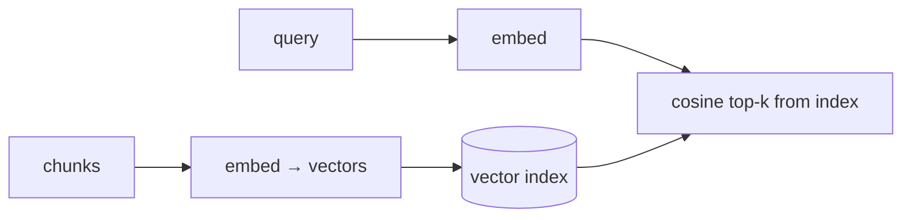

# Embeddings & semantic code search

> **Motto** — Lexical search finds the same words; semantic search finds the same meaning.

*Part of Phase 13 — Retrieval & Codebase Understanding.*

## The Problem

Lexical search (lesson 01) fails when the query and the code use different words: search
"authenticate user" and miss `def login()`. **Embeddings** map text to vectors where similar
*meaning* lands nearby, so a semantic search retrieves `login` for "authenticate". Build the
mechanics — embed, store, cosine-rank — with a toy embedder so the idea is concrete, then
swap in a real model.

## The Concept



## Build It

`code/semantic.py` — a toy bag-of-words embedder + cosine search (real models replace the
embedder, the rest is identical):

```python
import math
from collections import Counter

def embed(text):                       # toy: word-count vector (a real model: dense vec)
    return Counter(text.lower().split())

def cosine(a, b):
    dot = sum(a[k] * b.get(k, 0) for k in a)
    na = math.sqrt(sum(v * v for v in a.values()))
    nb = math.sqrt(sum(v * v for v in b.values()))
    return dot / (na * nb) if na and nb else 0.0

class SemanticIndex:
    def __init__(self):
        self.items = []                # (text, vector)

    def add(self, text):
        self.items.append((text, embed(text)))

    def search(self, query, k=3):
        qv = embed(query)
        ranked = sorted(self.items, key=lambda it: cosine(qv, it[1]), reverse=True)
        return [t for t, _ in ranked[:k]]
```

```python
ix = SemanticIndex()
for doc in ["def login(): authenticate the user",
            "def add(a, b): return a + b",
            "class Session: user session state"]:
    ix.add(doc)
print(ix.search("authenticate user")[0])    # the login doc ranks first
```

The pipeline — embed corpus, embed query, cosine top-k — is exactly what production vector
search does; only `embed` changes (to a real embedding model) and the index gets an ANN
structure for scale.

## Use It

Real code search (and RAG) uses an embedding model + a vector DB. For a coding agent, this
powers "find code related to X" beyond exact strings. Note the cost/latency tradeoff: embed
once, search cheaply — but keep the index fresh as code changes (stale embeddings retrieve
deleted code).

## Ship It

[`code/semantic.py`](../../02-embeddings/code/semantic.py) — a toy embedder + cosine semantic
index.

## Check Yourself

**Q1.** When does semantic search beat lexical?

- A) never
- B) when query and code share meaning but not words ("authenticate" → `login`)
- C) only for exact matches
- D) for numbers

<details><summary>Answer</summary>B — meaning over surface form.</details>

**Q2.** What's the freshness risk with an embedding index?

- A) none
- B) stale embeddings can retrieve code that was changed or deleted
- C) it's too fast
- D) it uses no memory

<details><summary>Answer</summary>B — keep the index in sync with the code.</details>

**Challenge.** Swap `embed` for a real embedding model and compare its top-k to the toy
embedder on the same corpus.

## Related

- Builds on: [Repo maps](../../01-repo-maps/docs/en.md)
- Next: [Hybrid search & reranking](../../03-hybrid-search/docs/en.md)
- [Roadmap](../../../../ROADMAP.md)
