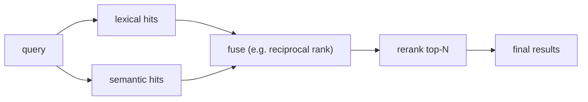

# Hybrid search & reranking

> **Motto** — Combine lexical and semantic hits, then rerank — each catches what the other misses.

*Part of Phase 13 — Retrieval & Codebase Understanding.*

## The Problem

Lexical search nails exact identifiers (`parse_config`) but misses paraphrases; semantic
search nails meaning but can rank a vaguely-related file above the exact one. Using either
alone leaves recall on the table. **Hybrid search** fuses both result lists, and a **rerank**
step reorders the merged set by a sharper relevance signal — the combination beats either.

## The Concept



A common, robust fusion is **reciprocal rank fusion (RRF)**: score each doc by the sum of
`1/(k+rank)` across the lists it appears in — no score calibration needed.

## Build It

`code/hybrid.py` — RRF fusion over two ranked lists:

```python
def rrf(*ranked_lists, k=60):
    scores = {}
    for lst in ranked_lists:
        for rank, doc in enumerate(lst):
            scores[doc] = scores.get(doc, 0) + 1 / (k + rank + 1)
    return [d for d, _ in sorted(scores.items(), key=lambda kv: kv[1], reverse=True)]
```

```python
lexical  = ["auth.py", "utils.py", "session.py"]
semantic = ["session.py", "auth.py", "login_flow.py"]
print(rrf(lexical, semantic))
# auth.py & session.py rise (appear high in both); singletons rank lower
```

RRF rewards docs that *both* methods rank highly, so the exact match (lexical) and the
meaning match (semantic) reinforce each other; a true reranker (a cross-encoder or an
LLM-as-judge over the top-N) can refine further.

## Use It

Production code search and RAG almost always go hybrid + rerank — it's the single biggest
recall/precision win after basic retrieval. For an agent, this is "find the relevant code"
done well; the reranker is often an LLM scoring the top-N for actual relevance to the task
(connecting to Phase 15 LLM-as-judge).

## Ship It

[`code/hybrid.py`](../../03-hybrid-search/code/hybrid.py) — reciprocal-rank-fusion hybrid
search.

## Check Yourself

**Q1.** Why fuse lexical and semantic results?

- A) redundancy
- B) each catches what the other misses (exact identifiers vs. meaning)
- C) to slow down
- D) no reason

<details><summary>Answer</summary>B — complementary recall.</details>

**Q2.** What does RRF reward?

- A) the longest document
- B) documents ranked highly by multiple methods
- C) random docs
- D) the newest file

<details><summary>Answer</summary>B — agreement across lists, no score calibration
needed.</details>

**Challenge.** Add an LLM-as-judge rerank: take the RRF top-10 and have the model score each
for relevance to the query, then sort by that score (forward ref to Phase 15).

## Related

- Builds on: [Repo maps](../../01-repo-maps/docs/en.md), [Embeddings](../../02-embeddings/docs/en.md)
- Next: [Chunking code without breaking it](../../04-chunking/docs/en.md)
- Related: Phase 15 — LLM-as-judge
- Other tracks: [RAG architecture](../../../../../content/03-rag/rag-architecture.md) · [Storage & querying](../../../../../knowledge-graphs/storage-and-querying.md) — the retrieval stack and the graph query layer this phase mirrors.
- [Roadmap](../../../../ROADMAP.md)
