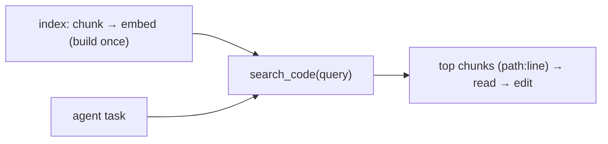

# Use it: a retrieval tool the agent calls

> **Motto** — Wrap chunk → embed → hybrid-search into one `search_code` tool the agent invokes.

*Part of Phase 13 — Retrieval & Codebase Understanding. Completes the phase.*

## The Problem

You've built repo maps, embeddings, hybrid search, and code chunking. The payoff is a single
**retrieval tool** the agent can call — `search_code(query)` returns the most relevant
chunks with their `path:line` — so on any task it can *find* the right code instead of
blindly Grep-ing or reading whole files. This is retrieval as a first-class tool in the loop.

## The Concept



## Build It / Use It

`code/retrieval_tool.py` composes the phase: chunk files, index them, and expose
`search_code` returning ranked chunks (toy embedder so it runs; swap in a real model + the
RRF hybrid for production):

```python
# composes chunk_code (L4) + SemanticIndex (L2)
class CodeSearch:
    def __init__(self):
        self.index = SemanticIndex()
        self.meta = []

    def add_file(self, path, source):
        for ch in chunk_code(source):
            self.index.add(ch["code"])
            self.meta.append({"path": path, "name": ch["name"], "lines": ch["lines"]})

    def search_code(self, query, k=3):
        hits = self.index.search(query, k)
        # map hit text back to metadata (path:line) for the agent to read
        out = []
        for text in hits:
            i = next(j for j, (_, v) in enumerate(self.index.items) if _ == text)
            m = self.meta[i]
            out.append(f"{m['path']}:{m['lines'][0]}  {m['name']}")
        return out
```

```python
cs = CodeSearch()
cs.add_file("auth.py", "def login(u):\n    'authenticate the user'\n    return u\n")
cs.add_file("math.py", "def add(a, b):\n    return a + b\n")
print(cs.search_code("authenticate user"))   # ['auth.py:1  login']
```

Exposed as a tool (Phase 3) — or an MCP server (Phase 12) — `search_code` lets the agent
locate code semantically, then Read/Edit the returned `path:line`.

## Use It

This is what "the agent understands the codebase" really means: a retrieval tool (built in,
or an MCP code-search server) that returns relevant locations, which the agent reads and
edits. Combined with the repo map and a good `CLAUDE.md`, it's how Claude Code / Codex stay
effective in large repos without loading everything into context.

## Ship It

[`code/retrieval_tool.py`](../../05-retrieval-tool/code/retrieval_tool.py) — a `search_code`
retrieval tool composing the phase.

## Check Yourself

**Q1.** What should `search_code` return to be useful to the agent?

- A) whole files
- B) ranked chunks with `path:line` to Read and Edit
- C) a yes/no
- D) embeddings

<details><summary>Answer</summary>B — locations the agent can act on.</details>

**Q2.** How is retrieval exposed to the agent?

- A) only in the prompt
- B) as a tool (Phase 3) or an MCP code-search server (Phase 12)
- C) it can't be
- D) as a resource only

<details><summary>Answer</summary>B — retrieval is a callable tool.</details>

**Challenge.** Swap the toy embedder for a real model and the single index for the RRF hybrid
(lesson 03), then expose `search_code` as an MCP server (Phase 12).

## Related

- Builds on: the whole phase
- Exposed via: Phase 3 — Tools, Phase 12 — MCP
- Phase complete → next: Phase 14 — [Reliability Engineering](../../../../ROADMAP.md)
- [Roadmap](../../../../ROADMAP.md)
