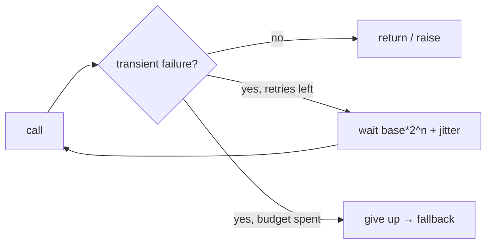

# Retries, backoff & jitter

> **Motto** — Transient failures deserve a retry — with growing, jittered delays so you don't stampede.

*Part of Phase 14 — Reliability Engineering.*

## The Problem

Model and tool calls fail transiently: rate limits (429), overloaded servers (503), network
blips. Giving up on the first failure makes the agent flaky; retrying *immediately* and in
lockstep with everyone else makes the overload worse. The fix is **exponential backoff with
jitter**: wait longer after each failure, with randomness so concurrent clients don't retry
in sync.

## The Concept



Only **transient** errors retry; a 400 (bad request) won't fix itself, so it fails fast.

## Build It

`code/retry.py` — exponential backoff + jitter (sleep injected so it's testable):

```python
import random

TRANSIENT = (429, 500, 502, 503, 504)

def retry(call, is_transient, max_attempts=5, base=0.5, sleep=lambda s: None, rng=random):
    for attempt in range(max_attempts):
        try:
            return call()
        except Exception as e:
            if not is_transient(e) or attempt == max_attempts - 1:
                raise
            delay = base * (2 ** attempt) + rng.uniform(0, base)   # backoff + jitter
            sleep(delay)
```

```python
calls = {"n": 0}
def flaky():
    calls["n"] += 1
    if calls["n"] < 3:
        raise RuntimeError("503")
    return "ok"
print(retry(flaky, is_transient=lambda e: "503" in str(e)))   # ok (after 2 backoffs)
```

The delay grows (`base·2ⁿ`) and adds jitter; a non-transient error or exhausted budget
re-raises so the caller can fall back (lesson 03) instead of hanging.

## Use It

The Anthropic SDK retries idempotent requests with backoff by default; you add retries
around *your* tool calls and any non-SDK I/O. The rule that pairs with this: retried actions
must be idempotent (Phase 3 lesson 04) — otherwise a retry double-acts. Backoff+jitter is the
same discipline whether it's an API call or a flaky test.

## Ship It

[`code/retry.py`](../../01-retries/code/retry.py) — exponential-backoff-with-jitter retry.

## Check Yourself

**Q1.** Why add jitter to backoff?

- A) to look random
- B) so many clients don't retry in lockstep and re-overload the server
- C) it's required
- D) no reason

<details><summary>Answer</summary>B — jitter de-synchronizes retries.</details>

**Q2.** Which error should NOT be retried?

- A) 429 rate limit
- B) 503 overloaded
- C) 400 bad request (won't fix itself)
- D) a network timeout

<details><summary>Answer</summary>C — fail fast on non-transient errors.</details>

**Challenge.** Add a maximum total delay cap and respect a `Retry-After` header value when
present (overriding the computed backoff).

## Related

- Builds on: Phase 3 — [Idempotency](../../../03-tool-engineering/04-idempotency/docs/en.md), Phase 2 — [Error recovery](../../../02-the-agent-loop/06-error-recovery/docs/en.md)
- Next: [Validation & repair loops](../../02-repair-loops/docs/en.md)
- [Roadmap](../../../../ROADMAP.md)
