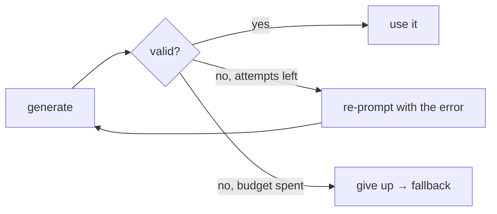

# Validation & Repair Loops

> **Motto** — When output fails validation, hand the model the error and let it fix itself — within a budget.

*Part of Phase 14 — Reliability Engineering.*

## The Problem

Even with good prompting, model output sometimes fails its contract: malformed JSON (Phase 1
L7), a missing section (Phase 5 L4), a tool arg that won't validate (Phase 3 L2). Rejecting
outright is wasteful; the model can usually *repair* if you show it the specific error. A
repair loop validates, and on failure re-prompts with the error — bounded so it can't loop
forever.

## The Concept



## Build It

`code/repair.py` — a generic validate-and-repair loop:

```python
def repair_loop(generate, validate, max_attempts=3):
    """generate(feedback)->output; validate(output)->None|error_message."""
    feedback = None
    for attempt in range(max_attempts):
        out = generate(feedback)
        err = validate(out)
        if err is None:
            return {"ok": True, "output": out, "attempts": attempt + 1}
        feedback = f"Your output was invalid: {err}. Fix it and return only the corrected output."
    return {"ok": False, "error": err, "attempts": max_attempts}
```

```python
# model that omits a field until told
state = {"n": 0}
def gen(feedback):
    state["n"] += 1
    return '{"name": "ada"}' if state["n"] == 1 else '{"name": "ada", "age": 36}'
def val(o):
    import json
    return None if "age" in json.loads(o) else "missing 'age'"
print(repair_loop(gen, val))     # ok after 2 attempts
```

The error string is the repair signal — specific and model-readable, the same
errors-are-data principle as the agent loop, now bounded by an attempt budget so a
persistently-broken generator falls through to a fallback.

## Use It

This wraps any structured generation in Claude Code / Codex: JSON tool args, a required
output format, a code patch that must apply. Prefer prevention first (tool-schema output,
Phase 3 L7) — the repair loop is the safety net when the contract still isn't met. Pair it
with retries (lesson 01): retries handle *transport* failures, repair handles *content*
failures.

## Ship It

[`code/repair.py`](../../02-repair-loops/code/repair.py) — a bounded validate-and-repair loop.

## Check Yourself

**Q1.** What does the repair loop feed back to the model on failure?

- A) nothing
- B) the specific validation error, so it can correct
- C) the whole conversation
- D) a generic "try again"

<details><summary>Answer</summary>B — specific, model-readable errors drive repair.</details>

**Q2.** Retries vs. repair loops handle…

- A) the same thing
- B) retries → transport failures; repair → content/validation failures
- C) only JSON
- D) nothing

<details><summary>Answer</summary>B — different failure classes, often combined.</details>

**Challenge.** Combine with Phase 1 L7's JSON extractor: validate by parsing, and on failure
feed back the exact parse error and the offending substring.

## Related

- Builds on: [Retries](../../01-retries/docs/en.md); Phase 1 — [Structured output](../../../01-llm-io-foundations/07-structured-output/docs/en.md)
- Next: [Fallback chains & model routing](../../03-fallback-routing/docs/en.md)
- [Roadmap](../../../../ROADMAP.md)
