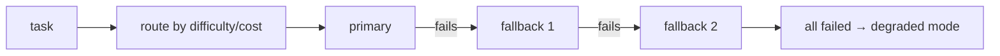

# Fallback Chains & Model Routing

> **Motto** — When the first choice fails or is overkill, route to the next — by health and by fit.

*Part of Phase 14 — Reliability Engineering.*

## The Problem

A single hardcoded model is a single point of failure and often the wrong cost/latency
tradeoff. **Routing** picks the right model per task (cheap model for simple work, strong
model for hard work), and a **fallback chain** tries the next option when one errors or is
overloaded — so a provider blip degrades quality, not availability.

## The Concept



Routing chooses the *first* try by fit; the chain handles *failure* by trying the rest.

## Build It

`code/routing.py` — a router + fallback chain:

```python
def route(task, simple_model, strong_model, is_hard):
    return [strong_model, simple_model] if is_hard(task) else [simple_model, strong_model]

def with_fallback(chain, call):
    """Try each option in order; return first success, else raise the last error."""
    last = None
    for option in chain:
        try:
            return {"model": option, "result": call(option)}
        except Exception as e:
            last = e
    raise RuntimeError(f"all options failed: {last}")
```

```python
def call(model):
    if model == "strong": raise RuntimeError("overloaded")
    return f"answer from {model}"
chain = route("simple task", "haiku", "strong", is_hard=lambda t: "complex" in t)
print(with_fallback(["strong", "haiku"], call))   # falls back to haiku
```

Routing keeps cost down on easy tasks; the fallback chain keeps the service up when the
preferred model errors — both decisions live in the harness, not the business logic.

## Use It

For Claude Code / Codex users this is model selection (e.g. a fast model for routine edits,
a stronger model for hard reasoning) plus the SDK/provider's resilience. In a custom harness
you implement the chain explicitly. Key principle (from the conceptual track): you can change
models without rewriting business logic — routing is a harness concern.

## Ship It

[`code/routing.py`](../../03-fallback-routing/code/routing.py) — a model router + fallback
chain.

## Check Yourself

**Q1.** Routing decides ___; a fallback chain handles ___.

- A) failure; cost
- B) the first try by fit (cost/difficulty); failure by trying the next option
- C) nothing; everything
- D) tokens; latency

<details><summary>Answer</summary>B — fit first, failure next.</details>

**Q2.** Why route simple tasks to a cheaper model?

- A) accuracy
- B) cost/latency — don't pay for a strong model on trivial work
- C) it's required
- D) no reason

<details><summary>Answer</summary>B — match capability to need.</details>

**Challenge.** Add a circuit breaker: after N consecutive failures of an option, skip it for
a cooldown period instead of retrying it every time.

## Related

- Builds on: [Retries](../../01-retries/docs/en.md)
- Next: [Loop, tool & token budgets](../../04-budgets/docs/en.md)
- [Roadmap](../../../../ROADMAP.md)
