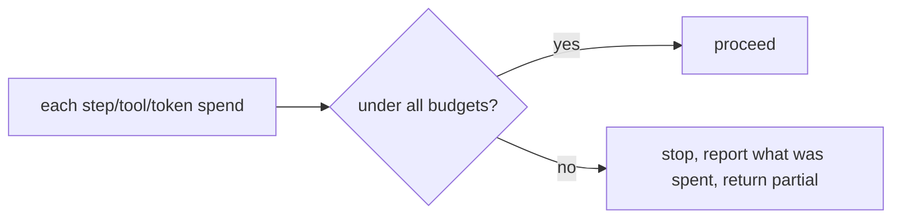

# Loop, tool & token budgets

> **Motto** — Put a hard ceiling on steps, tools, tokens, and dollars per request — always.

*Part of Phase 14 — Reliability Engineering.*

## The Problem

The single most important guard against a runaway agent is a **budget**. Step ceilings
(Phase 2), tool budgets (Phase 3), and now token/cost ceilings together bound the worst case:
no request can loop forever or spend unbounded money. A harness without budgets is one
confused plan away from a $100 bill or an infinite loop. Budgets make the worst case
*known*.

## The Concept



Track multiple meters (steps, tool calls, tokens, est. cost); hitting any one stops the run
gracefully with a report — never silently and never auto-extended.

## Build It

`code/budget.py` — a multi-meter budget that the loop checks each step:

```python
class Budget:
    def __init__(self, max_steps=20, max_tokens=100_000, max_usd=1.0):
        self.limits = {"steps": max_steps, "tokens": max_tokens, "usd": max_usd}
        self.spent = {"steps": 0, "tokens": 0, "usd": 0.0}

    def charge(self, steps=0, tokens=0, usd=0.0):
        self.spent["steps"] += steps
        self.spent["tokens"] += tokens
        self.spent["usd"] += usd

    def exceeded(self):
        return [k for k in self.limits if self.spent[k] >= self.limits[k]]

    def report(self):
        return {k: f"{self.spent[k]}/{self.limits[k]}" for k in self.limits}
```

```python
b = Budget(max_steps=3, max_tokens=1000, max_usd=0.10)
for _ in range(5):
    if b.exceeded():
        break
    b.charge(steps=1, tokens=400, usd=0.03)
print(b.exceeded(), b.report())     # ['tokens'] hit first
```

The loop calls `charge` after each model/tool call and stops when `exceeded()` is non-empty —
returning what it has, with a report of where the budget went.

## Use It

Budgets are the orchestration ceilings from Phase 10 (`maxWorkers/maxCallsPerWorker/
maxWaves`) generalized to the single agent. For a Claude Code / Codex user, this is why long
autonomous runs should be scoped — and why the harness's step/token limits exist. Always set
them; never let "it'll probably be fine" be the only ceiling.

## Ship It

[`code/budget.py`](../../04-budgets/code/budget.py) — a multi-meter (steps/tokens/cost) budget
guard.

## Check Yourself

**Q1.** Why is a budget the most important runaway guard?

- A) it speeds things up
- B) it bounds the worst case — no infinite loops or unbounded spend
- C) it improves accuracy
- D) no reason

<details><summary>Answer</summary>B — budgets make the worst case known.</details>

**Q2.** On hitting a budget, the harness should…

- A) auto-extend it
- B) stop, return the partial result, and report what was spent
- C) ignore it
- D) crash

<details><summary>Answer</summary>B — stop gracefully; never auto-extend.</details>

**Challenge.** Wire `Budget` into the Phase 2 agent loop so each step charges steps+tokens
and the loop exits with the report when any meter is hit.

## Related

- Builds on: Phase 2 — [Termination](../../../02-the-agent-loop/03-termination/docs/en.md), Phase 3 — [Tool budgets](../../../03-tool-engineering/05-tool-budgets/docs/en.md)
- Next: [Degraded-mode UX](../../05-degraded-mode/docs/en.md)
- Related: Phase 10 — orchestration budgets, Phase 16 — cost
- [Roadmap](../../../../ROADMAP.md)
