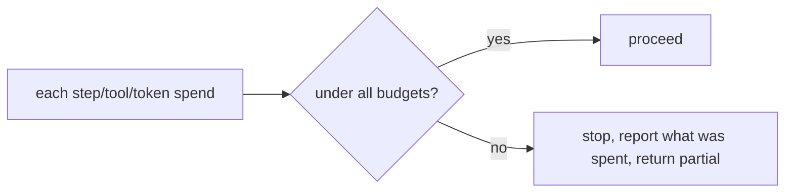

# Loop, tool & token budgets

> **Motto** — Put a hard ceiling on steps, tools, tokens, and dollars per request — always.

*Part of Phase 14 — Reliability Engineering.*

## The Problem

A **budget** is the single most important guard against a runaway agent. Step ceilings
(Phase 2), tool budgets (Phase 3), and token/cost ceilings work together to bound the worst
case. No request can loop forever or spend unbounded money. A harness without budgets is one
confused plan away from a $100 bill or an infinite loop. Budgets make the worst case *known*.

## The Concept


```mermaid
flowchart LR
  S["each step/tool/token spend"] --> B{"under all budgets?"}
  B -- "yes" --> GO["proceed"]
  B -- "no" --> STOP["stop, report what was spent, return partial"]
```

Track multiple meters: steps, tool calls, tokens, and estimated cost. Hitting any one meter
stops the run gracefully and reports what happened. The harness never stops silently and
never auto-extends a budget.

## Build It

`code/budget.py` — a multi-meter budget that the loop checks each step:

```python
class Budget:
    def __init__(self, max_steps=20, max_tokens=100_000, max_usd=1.0):
        self.limits = {"steps": max_steps, "tokens": max_tokens, "usd": max_usd}
        self.spent = {"steps": 0, "tokens": 0, "usd": 0.0}

    def charge(self, steps=0, tokens=0, usd=0.0):
        self.spent["steps"] += steps
        self.spent["tokens"] += tokens
        self.spent["usd"] += usd

    def exceeded(self):
        return [k for k in self.limits if self.spent[k] >= self.limits[k]]

    def report(self):
        return {k: f"{self.spent[k]}/{self.limits[k]}" for k in self.limits}
```

```python
b = Budget(max_steps=3, max_tokens=1000, max_usd=0.10)
for _ in range(5):
    if b.exceeded():
        break
    b.charge(steps=1, tokens=400, usd=0.03)
print(b.exceeded(), b.report())     # ['tokens'] hit first
```

The loop calls `charge` after each model or tool call. It stops when `exceeded()` returns a
non-empty list, and returns what it has so far, with a report of where the budget went.

## Use It

Budgets generalize the orchestration ceilings from Phase 10 (`maxWorkers/maxCallsPerWorker/
maxWaves`) down to the single agent. This is why a Claude Code or Codex user should scope
long autonomous runs, and why the harness's step and token limits exist. Always set them.
Never let "it'll probably be fine" be the only ceiling.

## Ship It

[`code/budget.py`](../../04-budgets/code/budget.py) — a multi-meter budget guard that tracks
steps, tokens, and cost.

## Check Yourself

**Q1.** Why is a budget the most important runaway guard?

- A) it speeds things up
- B) it bounds the worst case — no infinite loops or unbounded spend
- C) it improves accuracy
- D) no reason

<details><summary>Answer</summary>B — a budget makes the worst case known.</details>

**Q2.** On hitting a budget, the harness should…

- A) auto-extend it
- B) stop, return the partial result, and report what was spent
- C) ignore it
- D) crash

<details><summary>Answer</summary>B — stop gracefully. Never auto-extend.</details>

**Challenge.** Wire `Budget` into the Phase 2 agent loop so each step charges steps+tokens
and the loop exits with the report when any meter is hit.

## Related

- Builds on: Phase 2 — [Termination](../../../02-the-agent-loop/03-termination/docs/en.md), Phase 3 — [Tool budgets](../../../03-tool-engineering/05-tool-budgets/docs/en.md)
- Next: [Degraded-mode UX](../../05-degraded-mode/docs/en.md)
- Related: Phase 10 — orchestration budgets, Phase 16 — cost
- [Roadmap](../../../../ROADMAP.md)
