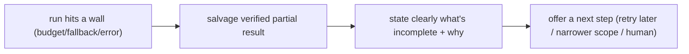

# Degraded-mode UX

> **Motto** — When the agent can't do the whole job, do part of it well and say what's missing.

*Part of Phase 14 — Reliability Engineering.*

## The Problem

Retries fail, fallbacks exhaust, budgets run out — sometimes the agent genuinely can't
complete the task. The wrong response is to crash with a stack trace or, worse, fabricate a
success. **Degraded mode** is the graceful answer: return whatever partial, verified result
you have, clearly state what couldn't be done and why, and offer a next step. This is the
reliability payoff users actually feel.

## The Concept



The contract: never silently drop work, never claim success you didn't verify (ties to
"report outcomes faithfully").

## Build It

`code/degraded.py` — wrap a run to always return a structured, honest result:

```python
def run_with_degrade(do, budget):
    """do(budget)->partial result dict. Always returns a structured outcome."""
    try:
        result = do(budget)
        hit = budget.exceeded()
        if hit:
            return {"status": "degraded", "partial": result,
                    "reason": f"budget exhausted: {hit}",
                    "next": "narrow the scope or raise the budget and resume"}
        return {"status": "complete", "result": result}
    except Exception as e:
        return {"status": "failed", "error": str(e),
                "next": "retry later or escalate to a human"}
```

```python
class B:                         # stand-in budget
    def __init__(self): self.over = True
    def exceeded(self): return ["tokens"] if self.over else []
print(run_with_degrade(lambda b: {"done": ["step1", "step2"]}, B()))
# status: degraded, partial result + reason + next step
```

Every outcome is structured and honest: complete, degraded (with partial + reason + next),
or failed (with error + next) — the user always knows exactly where things stand.

## Use It

For a Claude Code / Codex user this is the difference between "I edited 3 of 5 files; the
other 2 failed type-checking — here's the error and what I'd try next" versus a crash or a
false "done." Insist on it: a good agent reports partial progress and failures plainly. This
is the user-facing capstone of the whole reliability phase.

## Ship It

[`code/degraded.py`](../../05-degraded-mode/code/degraded.py) — a degrade-gracefully run
wrapper.

## Check Yourself

**Q1.** When the agent can't finish, the right response is…

- A) crash with a stack trace
- B) return verified partial work + what's missing + a next step
- C) claim success anyway
- D) silently stop

<details><summary>Answer</summary>B — graceful, honest degradation.</details>

**Q2.** Degraded mode must never…

- A) return partial results
- B) claim success that wasn't verified
- C) suggest a next step
- D) state a reason

<details><summary>Answer</summary>B — no fabricated success.</details>

**Challenge.** Extend the wrapper to attach the budget `report()` (Phase 14 L4) to a degraded
result so the user sees exactly what was spent.

## Related

- Builds on: [Budgets](../../04-budgets/docs/en.md), [Fallback routing](../../03-fallback-routing/docs/en.md)
- Next: [Production failure-mode playbook](../../06-failure-playbook/docs/en.md)
- [Roadmap](../../../../ROADMAP.md)
