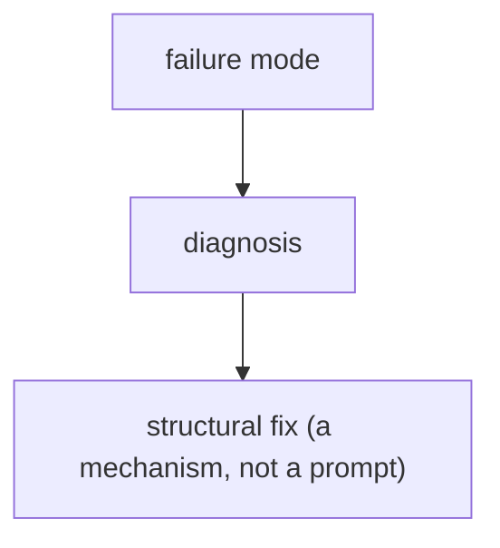

# Production failure-mode playbook

> **Motto** — Name the ways agents break in production, and the structural fix for each.

*Part of Phase 14 — Reliability Engineering. Completes the phase.*

## The Problem

You've built the reliability primitives (retries, repair, fallback, budgets, degraded mode).
The capstone is a **playbook**: a named list of the failure modes a coding-agent harness hits
in production and the *structural* fix for each — so when something breaks, you reach for the
mechanism, not a longer prompt. This is the reliability thread of the whole course in one
page.

## The Concept

## Build It (the playbook)

The artifact is `outputs/failure-playbook.md`. A sample of the entries:

| Failure mode | Structural fix |
| --- | --- |
| "The JSON sometimes doesn't parse" | validation + repair loop (L2); prefer tool-schema output (P3 L7) |
| "It worked yesterday" (silent regression) | golden-set eval + CI gate (P15) |
| "The agent ran 40 steps / spent $12" | step/tool/token/cost budgets (L4, P2, P3) |
| "Latency spikes / provider overloaded" | retries+backoff (L1), fallback chain (L3) |
| "It double-charged the customer" | idempotency keys (P3 L4) |
| "A retrieved doc hijacked the agent" | treat output as data; injection defenses (P17) |
| "It claimed success but tests failed" | verify before reporting; degraded mode (L5) |
| "Same mistake every week" | encode a lint rule / hook, delete the prompt line (P8, principles) |

Each row's fix is a mechanism you built — the playbook is the index from symptom to lesson.

## Use It

Keep this playbook handy as a pre-launch checklist and an incident guide for any agent you
ship — including how you operate Claude Code / Codex on real work. When you hit a new failure
mode, add a row: symptom → structural fix, and (per the harness principles) prefer patching
the harness over lengthening the prompt.

## Ship It

[`outputs/failure-playbook.md`](../../06-failure-playbook/outputs/failure-playbook.md) — a
production failure-mode → structural-fix playbook.

## Check Yourself

**Q1.** When the agent repeats a class of mistake, the playbook's prescribed fix is…

- A) a longer system prompt
- B) a mechanism (lint rule / hook / eval), then delete the prompt line
- C) a bigger model
- D) ignore it

Answer
B — patch the harness, not the prompt.

**Q2.** "It claimed success but tests failed" is fixed by…

- A) trusting the agent
- B) verifying before reporting + degraded mode (honest partial results)
- C) more retries
- D) a longer prompt

Answer
B — verification + honest reporting.

**Challenge.** Add three failure modes from your own experience with each one's structural
fix, and turn the table into a pre-launch checklist you run before shipping an agent.

## Related

- Builds on: the whole phase
- Concept: harness principles (patch the harness, not the prompt)
- Phase complete → next: Phase 15 — [Evals & Testing the Harness](../../../../ROADMAP.md)
- [Roadmap](../../../../ROADMAP.md)
