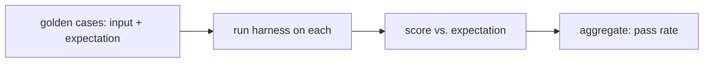

# Golden Tasks & Fixtures

> **Motto** — A golden set is your harness's test suite: fixed inputs, known-good outputs, a score.

*Part of Phase 15 — Evals & Testing the Harness.*

## The Problem

You can't tell whether a prompt tweak, model bump, or tool change helped or hurt without a
*measurement*. A **golden set** is the answer: a fixed list of representative tasks, each
with a known-good expectation and a scoring function. Run it before and after a change and
the diff in score tells you the truth — replacing "seems better" with a number.

## The Concept



Cases should be representative (cover the real distribution) and stable (a deterministic
score, or tolerant of acceptable variation).

## Build It

`code/golden.py` — a golden-set runner:

```python
def run_golden(cases, harness, score):
    """cases: [{input, expect}]; harness(input)->output; score(output, expect)->0..1."""
    results = []
    for c in cases:
        out = harness(c["input"])
        results.append({"input": c["input"], "score": score(out, c["expect"])})
    avg = sum(r["score"] for r in results) / len(results)
    return {"pass_rate": avg, "results": results}
```

```python
cases = [{"input": "2+2", "expect": "4"}, {"input": "cap of France", "expect": "Paris"}]
harness = lambda x: {"2+2": "4", "cap of France": "Lyon"}[x]   # buggy on case 2
score = lambda out, exp: 1.0 if exp.lower() in out.lower() else 0.0
print(run_golden(cases, harness, score)["pass_rate"])    # 0.5 — measurable
```

The pass rate is now a number you can track across changes; a drop points at exactly which
cases regressed.

## Use It

For a Claude Code / Codex workflow, a golden set can be a handful of representative tasks in
your repo ("fix this bug", "add this endpoint") with a check (tests pass, output matches).
Run it before/after changing `CLAUDE.md`, a skill, or the model. Evals are the discipline
that turns prompt/harness changes from guesswork into engineering.

## Ship It

[`code/golden.py`](../../01-golden-tasks/code/golden.py) — a golden-set eval runner.

## Check Yourself

**Q1.** What does a golden set let you do?

- A) make the agent faster
- B) measure whether a change helped or hurt, as a number
- C) remove tests
- D) nothing

<details><summary>Answer</summary>B — measurement, not vibes.</details>

**Q2.** Good golden cases are…

- A) random and unstable
- B) representative of the real distribution, with stable scoring
- C) all edge cases only
- D) as few as possible

<details><summary>Answer</summary>B — representative + stable.</details>

**Challenge.** Add per-case tags (e.g. "math", "retrieval") and report pass rate per tag, so
a regression localizes to a category.

## Related

- Builds on: Phase 1 — [Sampling/determinism](../../../01-llm-io-foundations/03-sampling/docs/en.md)
- Next: [Trajectory evals](../../02-trajectory-evals/docs/en.md)
- [Roadmap](../../../../ROADMAP.md)
