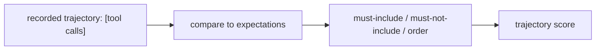

# Trajectory evals (did it take the right steps?)

> **Motto** — For an agent, *how* it got the answer matters as much as the answer.

*Part of Phase 15 — Evals & Testing the Harness.*

## The Problem

Golden-set scoring (lesson 01) checks the final output, but an agent can reach a right answer
the wrong way — skipping the tests, editing the wrong file first, calling a tool 10 times. A
**trajectory eval** scores the *sequence of actions*: did it call the expected tools, in a
sane order, without forbidden steps? This catches process bugs a final-answer check misses.

## The Concept



## Build It

`code/trajectory.py` — score a trajectory against expectations:

```python
def score_trajectory(steps, must_include=(), must_not=(), max_steps=None):
    tools = [s["tool"] for s in steps]
    problems = []
    for t in must_include:
        if t not in tools:
            problems.append(f"missing expected tool: {t}")
    for t in must_not:
        if t in tools:
            problems.append(f"used forbidden tool: {t}")
    if max_steps and len(steps) > max_steps:
        problems.append(f"too many steps: {len(steps)} > {max_steps}")
    score = 1.0 if not problems else max(0.0, 1 - 0.34 * len(problems))
    return {"score": round(score, 2), "problems": problems}
```

```python
traj = [{"tool": "read"}, {"tool": "edit"}, {"tool": "bash"}]   # ran tests via bash
print(score_trajectory(traj, must_include=["read", "bash"], must_not=["rm"], max_steps=10))
# score 1.0 — read the code, made the edit, ran tests; no forbidden tools
```

Trajectory checks encode process expectations — "always run tests", "never call the delete
tool", "don't exceed N steps" — and score how well a run followed them.

## Use It

For coding agents this is how you verify good *habits*, not just good answers: did it read
before editing (Phase 6), run tests before claiming done (Phase 11), stay within budget
(Phase 14)? Trajectory evals over recorded runs (traces, Phase 16) catch regressions in
behavior that output-only checks would miss.

## Ship It

[`code/trajectory.py`](../../02-trajectory-evals/code/trajectory.py) — a trajectory scorer
(must-include / forbidden / step cap).

## Check Yourself

**Q1.** What does a trajectory eval check that a golden-output check doesn't?

- A) the final answer
- B) the sequence of actions — which tools, what order, forbidden steps
- C) latency
- D) cost

<details><summary>Answer</summary>B — the process, not just the result.</details>

**Q2.** A trajectory eval is the right tool to enforce…

- A) output formatting
- B) habits like "read before edit" and "run tests before done"
- C) token counts
- D) nothing

<details><summary>Answer</summary>B — process expectations.</details>

**Challenge.** Add ordering constraints (e.g. `read` must appear before `edit`) and penalize
violations distinctly from missing tools.

## Related

- Builds on: [Golden tasks](../../01-golden-tasks/docs/en.md)
- Next: [LLM-as-judge](../../03-llm-as-judge/docs/en.md)
- Uses: Phase 16 — traces
- [Roadmap](../../../../ROADMAP.md)
