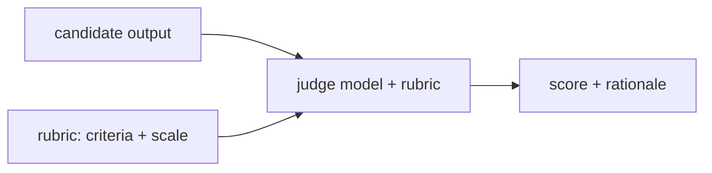

# LLM-as-judge

> **Motto** — When there's no exact answer to match, have a model score the output against a rubric.

*Part of Phase 15 — Evals & Testing the Harness.*

## The Problem

Many outputs have no single correct string — a code explanation, a refactor, a summary. You
can't `==` them against an expectation. **LLM-as-judge** scores such outputs: a model grades
the candidate against a written rubric (correctness, completeness, style), returning a score
and rationale. It scales subjective evaluation — but only if the rubric is specific and the
judge is well-controlled.

## The Concept



Guardrails: a concrete rubric, a fixed scale, low temperature, and (ideally) the judge
doesn't see which system produced the output (avoid bias).

## Build It

`code/judge.py` — the judge harness with the model call abstracted (so it's testable):

```python
RUBRIC = """Score the answer 0-5 on:
- correctness (is it right?)
- completeness (does it cover the question?)
Return JSON: {"score": <0-5>, "reason": "<one line>"}."""

def judge(output, question, call_model, rubric=RUBRIC):
    prompt = f"{rubric}\n\nQuestion: {question}\nAnswer: {output}"
    import json
    return json.loads(call_model(prompt))      # model returns the JSON verdict

def normalize(verdict, scale=5):
    return verdict["score"] / scale            # 0..1 for aggregation
```

```python
fake_model = lambda p: '{"score": 4, "reason": "correct but missing an edge case"}'
v = judge("Paris is the capital of France.", "Capital of France?", fake_model)
print(v, "->", normalize(v))     # {'score': 4, ...} -> 0.8
```

In production `call_model` is a real (low-temperature) judge; the rubric and JSON contract
(Phase 1 L7) make the verdict parseable and the score aggregatable into a pass rate.

## Use It

LLM-as-judge powers evals where exact matching fails (code quality, explanations) and the
rerank step in retrieval (Phase 13). It's also the review agent from Phase 10 — a judge over
a diff. Caveats to teach: judges have biases (length, position, self-preference); validate
the judge against human labels before trusting it.

## Ship It

[`code/judge.py`](../../03-llm-as-judge/code/judge.py) — an LLM-as-judge rubric scorer.

## Check Yourself

**Q1.** When is LLM-as-judge the right eval?

- A) when there's an exact expected string
- B) when outputs are open-ended (quality, explanations) with no single correct answer
- C) for token counting
- D) never

<details><summary>Answer</summary>B — subjective/open-ended scoring.</details>

**Q2.** A key guardrail for a judge is…

- A) high temperature
- B) a concrete rubric + fixed scale (and validating against human labels)
- C) showing it the author
- D) no rubric

<details><summary>Answer</summary>B — specific rubric, controlled judge.</details>

**Challenge.** Add pairwise judging (A vs. B, "which is better?") which is often more
reliable than absolute scores, and aggregate win rates.

## Related

- Builds on: Phase 1 — [Structured output](../../../01-llm-io-foundations/07-structured-output/docs/en.md)
- Next: [Regression gates in CI](../../04-regression-gates/docs/en.md)
- Related: Phase 10 — review agent, Phase 13 — rerank
- [Roadmap](../../../../ROADMAP.md)
