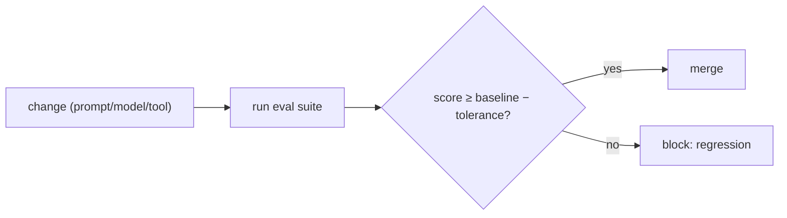

# Regression Gates in CI

> **Motto** — Block the change that drops the score — run the evals before it merges.

*Part of Phase 15 — Evals & Testing the Harness.*

## The Problem

Evals only protect you if they *run automatically* and *block regressions*. A **regression
gate** runs the golden/trajectory/judge evals in CI on every change to prompts, skills,
tools, or the model, compares the score to a baseline, and **fails the build** if it dropped
beyond a tolerance. This is what stops the silent "it worked yesterday" regression from the
failure playbook.

## The Concept



## Build It

`code/gate.py` — a CI gate comparing current score to a baseline:

```python
def gate(current, baseline, tolerance=0.02):
    """Return (passed, message). Fails if current dropped > tolerance below baseline."""
    delta = current - baseline
    if delta < -tolerance:
        return False, f"REGRESSION: {current:.3f} < baseline {baseline:.3f} (Δ{delta:+.3f})"
    return True, f"ok: {current:.3f} vs baseline {baseline:.3f} (Δ{delta:+.3f})"

def main(current, baseline):
    passed, msg = gate(current, baseline)
    print(msg)
    return 0 if passed else 1        # nonzero exit fails CI
```

```python
print(gate(0.91, 0.90))     # ok (improved)
print(gate(0.85, 0.90))     # REGRESSION (dropped 0.05 > tolerance)
```

The gate returns a nonzero exit code on regression so CI fails the PR — the eval suite
becomes a required check, exactly like unit tests.

## Use It

Wire this into the same CI that runs your tests: on a PR that touches `CLAUDE.md`, a skill,
a tool, or bumps the model, run the eval suite and gate on the score. For a Claude Code /
Codex user, even a tiny golden set gated in CI catches the prompt/skill change that quietly
made things worse. Store the baseline in the repo and update it intentionally when you
genuinely improve.

## Ship It

[`code/gate.py`](../../04-regression-gates/code/gate.py) — a CI regression gate with exit codes.

## Check Yourself

**Q1.** What makes a regression gate effective?

- A) running it manually sometimes
- B) running automatically in CI and failing the build on a score drop
- C) a longer prompt
- D) more models

<details><summary>Answer</summary>B — automatic + blocking.</details>

**Q2.** Why a tolerance band rather than exact equality?

- A) to ignore regressions
- B) to allow acceptable noise (non-determinism) while catching real drops
- C) it's required
- D) no reason

<details><summary>Answer</summary>B — tolerate noise, catch real regressions.</details>

**Challenge.** Make the gate write the new score back as the baseline only when run on the
main branch *and* the score improved, so baselines ratchet up.

## Related

- Builds on: [Golden tasks](../../01-golden-tasks/docs/en.md), [LLM-as-judge](../../03-llm-as-judge/docs/en.md)
- Next: [Adversarial & red-team cases](../../05-adversarial/docs/en.md)
- Related: Phase 18 — CI/deployment
- [Roadmap](../../../../ROADMAP.md)
